<div align=center>
	<font face="宋体" size=4>
		<strong>
			目录<br>
		</strong>
	</font>
</div>

<!-- TOC -->

- [**ROS基本概念**](#ros基本概念)
    - [**一、创建ROS工作空间**](#一创建ros工作空间)
    - [**二、编译ROS工作空间**](#二编译ros工作空间)
    - [**三、ROS工作空间文件夹结构**](#三ros工作空间文件夹结构)
    - [**四、常用包管理指令**](#四常用包管理指令)
    - [**五、Master和Node**](#五master和node)
    - [**六、ROS中的主流通信方法——Topic&Msg（单向通信）**](#六ros中的主流通信方法topicmsg单向通信)
    - [**七、ROS中的主流通信方式——Service（双向通信）**](#七ros中的主流通信方式service双向通信)
    - [**八、参数服务器（parameter server）**](#八参数服务器parameter-server)
    - [**九、ROS中的Action通信**](#九ros中的action通信)
    - [**十、记录和回放数据流的ROS命令行工具——rosbag**](#十记录和回放数据流的ros命令行工具rosbag)
- [**ROS编程核心**](#ros编程核心)
    - [**一、Client Library（用户库）**](#一client-library用户库)
    - [**二、Topic_test的roscpp编写练习**](#二topic_test的roscpp编写练习)
    - [**三、Service_test的roscpp编写练习**](#三service_test的roscpp编写练习)
    - [**四、param_test的roscpp编写重点**](#四param_test的roscpp编写重点)
    - [**五、TF（坐标系变换）和URDF（统一机器人描述格式）**](#五tf坐标系变换和urdf统一机器人描述格式)
- [**工作案例**](#工作案例)
    - [**一、基于ROS的openCV人脸识别**](#一基于ros的opencv人脸识别)

<!-- /TOC -->

# **ROS基本概念** #

## **一、创建ROS工作空间** ##
**命令**：<br>
<font face="Times New Roman" size=3>**$ mkdir -p ./catkin_ws/src**</font><br>
<font color=red size=2>**说明**：catkin_ws文件夹是ROS工作空间所在的目录，src文件夹中存放的是程序</font>
<br>

## **二、编译ROS工作空间** ##
ROS-melodic是运用catkin_make来对程序进行编译的，换言之：catkin_make最主要的功能是编译ROS程序<br>
**命令**：<br>
<font face="Times New Roman" size=3>**$ cd ./catkin_ws**</font><br>
<font face="Times New Roman" size=3>**$ catkin_make**</font><br>

<font color=tan size=2>
	<strong>
		注意：<br>
		1.catkin_make一定要在catkin工作空间文件夹中运行，否则会失败<br>
		2.catkin_make编译后，会在工作空间中自动生成两个文件夹build和devel，我们主要了解和管理的就是我们自己创建的src文件夹<br>
		3.每次catkin_make结束后，一定要source刷新devel（catkin_make生成的文件夹）下的setup.bash环境<br>
		4.package是catkin_make的基本单元<br>
	</strong>
</font>
<br>

## **三、ROS工作空间文件夹结构** ##
文件目录结构：<br>
<font face="Times New Roman">
catkin_ws/<br>
&emsp;&emsp;src/<br>
&emsp;&emsp;&emsp;&emsp;CMakeLists.txt<br>
&emsp;&emsp;&emsp;&emsp;package 1/<br>
&emsp;&emsp;&emsp;&emsp;&emsp;&emsp;CMakeLists.txt<br>
&emsp;&emsp;&emsp;&emsp;&emsp;&emsp;package.xml<br>
&emsp;&emsp;&emsp;&emsp;&emsp;&emsp;include/&emsp;&emsp;&emsp;*——主要存放C++的.h头文件*<br>
&emsp;&emsp;&emsp;&emsp;&emsp;&emsp;src/&emsp;&emsp;&emsp;&emsp;&emsp;*——主要存放C++的.cpp源文件*<br>
&emsp;&emsp;&emsp;&emsp;package 2/<br>
&emsp;&emsp;&emsp;&emsp;&emsp;&emsp;CMakeLists.txt<br>
&emsp;&emsp;&emsp;&emsp;&emsp;&emsp;package.xml<br>
&emsp;&emsp;&emsp;&emsp;&emsp;&emsp;include/&emsp;&emsp;&emsp;*——主要存放C++的.h头文件*<br>
&emsp;&emsp;&emsp;&emsp;&emsp;&emsp;src/&emsp;&emsp;&emsp;&emsp;&emsp;*——主要存放C++的.cpp源文件*<br>
&emsp;&emsp;&emsp;&emsp;……<br>
&emsp;&emsp;&emsp;&emsp;package n/<br>
&emsp;&emsp;&emsp;&emsp;&emsp;&emsp;CMakeLists.txt<br>
&emsp;&emsp;&emsp;&emsp;&emsp;&emsp;package.xml<br>
&emsp;&emsp;&emsp;&emsp;&emsp;&emsp;include/&emsp;&emsp;&emsp;*——主要存放C++的.h头文件*<br>
&emsp;&emsp;&emsp;&emsp;&emsp;&emsp;src/&emsp;&emsp;&emsp;&emsp;&emsp;*——主要存放C++的.cpp源文件*<br>
&emsp;&emsp;build/<br>
&emsp;&emsp;devel/<br>
</font>
<br>

## **四、常用包管理指令** ##
<font face="Times New Roman" size=3>1. **rospack**</font><br>
<font face="Times New Roman" size=2>列出本地所有pkg：$ rospack list</font><br>
<font face="Times New Roman" size=2>查找某个pkg的地址：$ rospack find *package_name*</font><br>
<font face="Times New Roman" size=3>2. **roscd**</font><br>
<font face="Times New Roman" size=2>跳转到某个pkg的目录下：$ roscd *package_name*</font><br>
<font face="Times New Roman" size=3>3. **rosls**</font><br>
<font face="Times New Roman" size=2>列举某个pkg目录下的文件信息：$ rosls *package_name*</font><br>
<font face="Times New Roman" size=3>4. **rosed**</font><br>
<font face="Times New Roman" size=2>编辑pkg目录下的文件：$ rosed *package_name* *file_name*</font><br>
<font face="Times New Roman" size=3>5. **catkin_create_pkg**</font><br>
<font face="Times New Roman" size=2>创建一个pkg：$ catkin_create_pkg <*pkg_name*> [*deps*]</font><br>
<font face="Times New Roman" size=3>例：$ catkin_create_pkg test roscpp rospy std_msgs nav_msgs</font><br>
<font face="Times New Roman" size=3>（创建了一个名为test的包，test后面所有的都是包所需的依赖）</font><br>
<font face="Times New Roman" color=red size=2>roscpp——ROS采用C++开发所需的依赖</font><br>
<font face="Times New Roman" color=red size=2>rospy——ROS采用python开发所需的依赖</font><br>
<font face="Times New Roman" color=red size=2>std_msgs——通信依赖</font><br>
<font face="Times New Roman" color=red size=2>nav_msgs——导航依赖</font><br>
<font face="Times New Roman" size=3>6. **rosdep**</font><br>
<font face="Times New Roman" size=2>安装某个pkg所需的依赖：$ rosdep install [*pkg_name*]</font><br>
<br>

## **五、Master和Node** ##
每个Node想要启动之前都必须要到Master那边去注册<br>
Master的主要功能就是Node之间的通信<br>
<font color=red size=2>**说明**：Node指的就是ROS中的进程是动态的，与其相对的是静态的pkg里的可执行文件</font><br>
<font size=3>**命令：**</font><br>
<font face="Times New Roman" size=3>启动ROS Master：**$ roscore**</font><br>
<font face="Times New Roman" size=3>启动Node：**$ rosrun [*pkg_name*] [*node_name*]**</font><br>
<font face="Times New Roman" size=3>列出当前运行的Node信息：**$ rosnode list**</font><br>
<font face="Times New Roman" size=3>显示某个Node的详细信息：**$ rosnode info [*node_name*]**</font><br>
<font face="Times New Roman" size=3>结束某个Node：**$ rosnode kill [*node_name*]**</font><br>
<font face="Times New Roman" size=3>启动Master和多个Node：**$ roslaunch [*pkg_name*] [*file_name.launch*]**</font><br>
<font color=red size=2>**说明**：如下是.launch文件的编写格式</font><br>

<div align=center>
	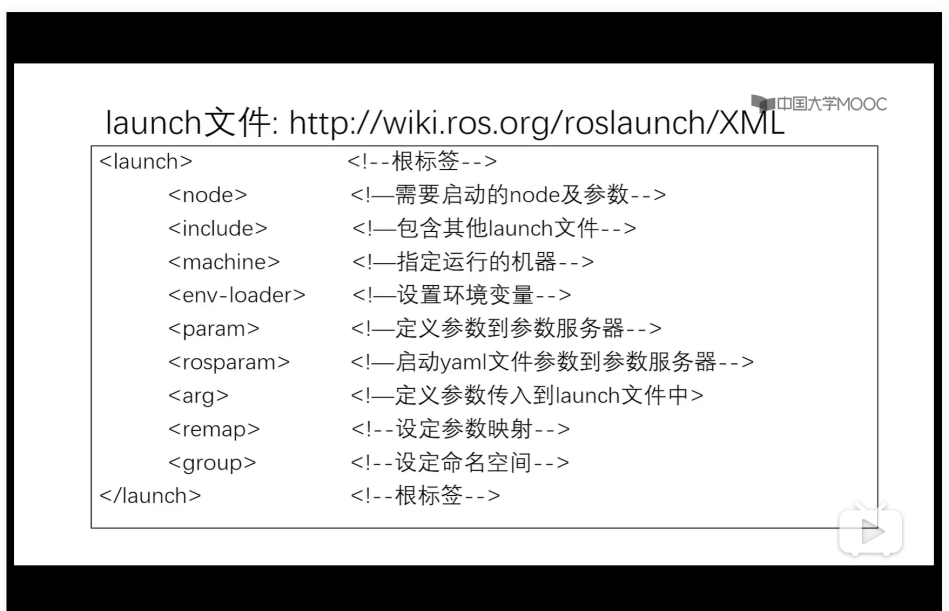<br>
</div>

<font color=tan size=2>
	<strong>
		注意：<br>
		1.一般将机器人启动的包命名为[robot_name]_bringup<br>
		2.如果使用网上下载的python脚本文件，在rosrun执行前需要chmod 777 [file_name].py，使脚本变为可执行文件<br>
	</strong>
</font>
<br>

## **六、ROS中的主流通信方法——Topic&Msg（单向通信）** ##
Topic通信机制是以publish-subscribe的形式来完成的，publisher发布信息，subscriber接受信息<br>
<font color=red size=2>**说明**：</font><br>
<font color=red size=2>1.Topic通信是异步的，即publisher只管发布信息，谁来接收无所谓；而subscriber只管接受信息，谁发布的不在乎</font><br>
<font color=red size=2>2.一个Topic可以有多个publisher和多个subscriber</font><br>
Message（Msg）是Topic的数据类型，其被定义在*.msg文件中（说白了Message就是类）<br>
<font color=red size=2>**说明**：</font><br>
<font color=red size=2>&emsp;&emsp;Msg中的基本数据类型：</font><br>
<font color=red size=2>&emsp;&emsp;bool、int8、int16、int32、int64（以及每个int所对应的uint）</font><br>
<font color=red size=2>&emsp;&emsp;float32、float64、string</font><br>
<font color=red size=2>&emsp;&emsp;time、duration、header</font><br>
<font color=red size=2>&emsp;&emsp;可变长度数组array[]、固定长度数组array[C]</font><br>

<font face="Times New Roman" size=4>**Topic和Msg之间的基本命令：**</font><br>
<font face="Times New Roman" size=3>**1.rostopic**</font><br>
<font face="Times New Roman" size=2>列出当前所有Topic：$ rostopic list</font><br>
<font face="Times New Roman" size=2>显示某个Topic的属性信息：$ rostopic info /*topic_name*</font><br>
<font face="Times New Roman" size=2>显示某个topic的内容：$ rostopic echo /*topic_name*</font><br>
<font face="Times New Roman" size=2>向某个topic发布内容：$ rostopic pub /*topic_name*</font><br>
<font face="Times New Roman" size=3>**2.rosmsg**</font><br>
<font face="Times New Roman" size=2>列出系统上所有msg：$ rosmsg list</font><br>
<font face="Times New Roman" size=2>显示某个msg内容：$ rosmsg show /*msg_name*</font><br>
<br>

## **七、ROS中的主流通信方式——Service（双向通信）** ##
与Topic不同，Service是ROS中同步通信的方式，各Node之间可以通过request-reply（请求-响应）的方式进行通信<br>
<font color=red size=2>**说明**：</font><br>
<font color=red size=2>1.同步通信指的是client（客户端）在向server（服务器）发送请求（request）后会阻塞等待，直到server响应其request后，才会执行先一步的操作</font><br>
<font color=red size=2>2.Topic和Service之间的对比</font><br>

<div align=center>
	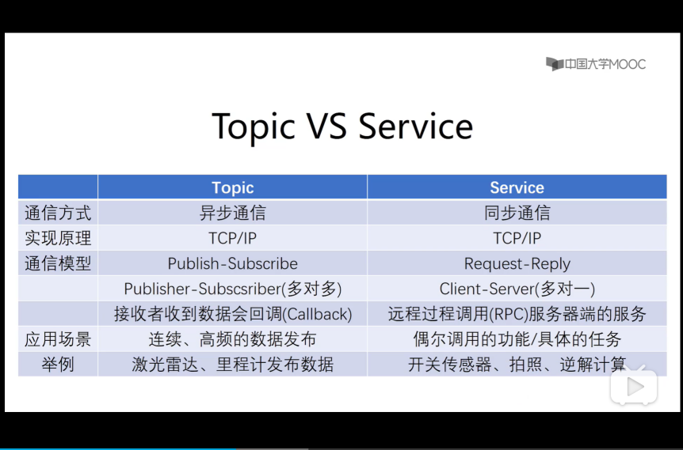<br>
</div>

Srv是Service通信的数据类型，其被定义在*.srv文件中（可以和Msg进行类比，方便理解）<br>
<font color=red size=2>**说明**：</font><br>
<font color=red size=2>1.*.srv文件的书写格式如下（红框标出的范围内容）</font><br>

<div align=center>
	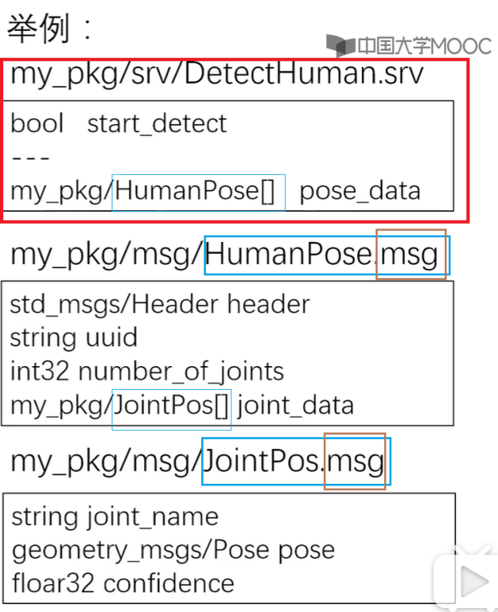<br>
</div>

<font color=red size=2>其中，“---”是分割线，上面是请求服务的代码数据所需要遵守的格式，下面是服务所返回的应答数据格式，即分割线上是“问”，分割线下是“答”</font><br>
<font color=red size=2>2.因为client和server之间是多对一的格式，所以.srv文件内是不能嵌套.srv文件的，只能嵌套.msg文件（上图篮筐标出的范围内容）</font><br>
<font color=red size=2>3.上图中HumanPose[]和JointPose[]都是自定义数组，因为可能会同时检测到多个不同的人，同时每个人一定有多个关节，其具体的定义都在.msg文件中完成。</font><br>

<font color=tan size=2>
	<strong>
		注意：<br>
		1.添加完.srv和.msg文件之后，一定要在package.xml中添加所需的依赖，同时还要修改CMakeList.txt文件中的代码信息<br>
	</strong>
</font>

<div align=center>
	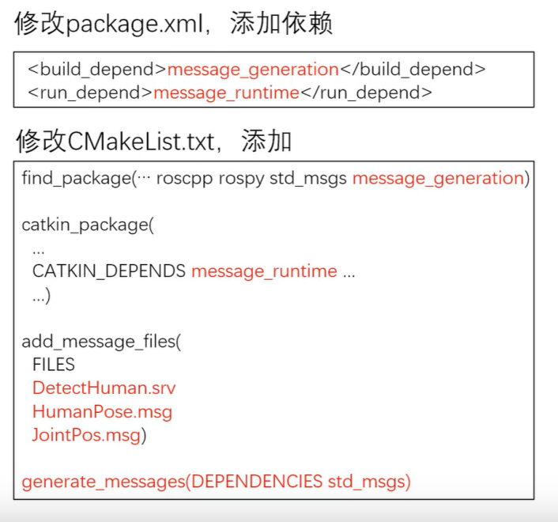<br>
</div>

<font face="Times New Roman" size=4>**Service通信的基本命令：**</font><br>
<font face="Times New Roman" size=3>**1.rosservice**</font><br>
<font face="Times New Roman" size=2>列出当前所有活跃的service：$ rosservice list</font><br>
<font face="Times New Roman" size=2>显示某个service的属性信息：$ rosservice info *service_name*</font><br>
<font face="Times New Roman" size=2>调用某个service：$ rosservice call *service_name* *args*</font><br>
<font face="Times New Roman" size=2>（args是所希望传入的参数）</font><br>
<font face="Times New Roman" size=3>**2.rossrv**</font><br>
<font face="Times New Roman" size=2>列出系统上所有srv：$ rossrv list</font><br>
<font face="Times New Roman" size=2>显示某个service：$ rossrv show *srv_name*</font><br>
<br>

## **八、参数服务器（parameter server）** ##
Parameter server主要存储各种参数和不常改变的数据，可以理解为字典，因为其记录的就是各个参数的具体映射关系。<br>
维护方式：可用命令行、launch文件和node（API）读写<br>
<br>
<font face="Times New Roman" size=3>命令行设置参数的命令——**rosparam**：</font><br>
<font face="Times New Roman" size=2>列出当前所有参数：**$ rosparam list**</font><br>
<font face="Times New Roman" size=2>显示某个参数的值：**$ rosparam get *param_key* **</font><br>
<font face="Times New Roman" size=2>设置某个参数的值：**$ rosparam set *param_key* *param_value* **</font><br>
<font face="Times New Roman" size=2>保存参数到文件：**$ rosparam dump *file_name* **</font><br>
<font face="Times New Roman" size=2>从文件读取参数：**$ rosparam load *file_name* **</font><br>
<font face="Times New Roman" size=2>删除参数与参数的值：**$ rosparam delete *param_key* **</font><br>

<font color=tan size=2>
	<strong>
		注意：<br>
		1.load或者dump参数的文件必须遵守YAML文件格式，文件格式如下图所示，其中“:”左边是参数名称，即param_key；而“:”右边是参数值，即param_value，而整个YAML文件就可以理解为字典。<br>
		<div align=center>
			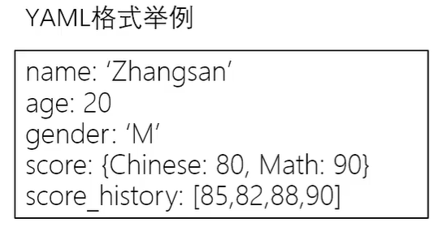<br>
		</div>
		2.launch文件中与参数服务器相关的标签就两个，分别是<param>和<rosparam>，其二者的区别是<param>只能给一个参数赋值，而<rosparam>可以对整个YAML格式文件进行操作.<br>
	</strong>
	案例:<br>
	&#60;param name=”publish_frequency” value=”100”/&#62;&emsp;&emsp;&emsp;&emsp;——设置名为“publish_frequency”的参数为100<br>
	&#60;rosparam file=”$(find robot_sim_demo)/config/xbot2_control.yaml” command=”load”/&#62;&emsp;&emsp;&emsp;&emsp;——通过command来操控整个.yaml文件里的参数<br>
</font>
<br>

## **九、ROS中的Action通信** ##
Action通信类似于Service通信，只是Action多了一个状态反馈，其主要运用于长时间、可抢占的任务中，其通信结构如下图所示：<br>

<div align=center>
	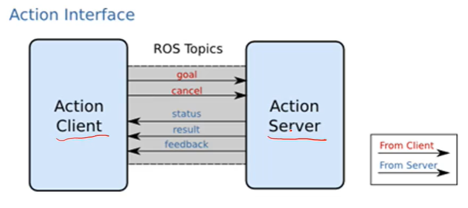<br>
</div>

Action通信的数据格式所对应的文件就叫做action，其数据被定义在*.action文件中，*.action文件的书写格式如下图所示：<br>

<div align=center>
	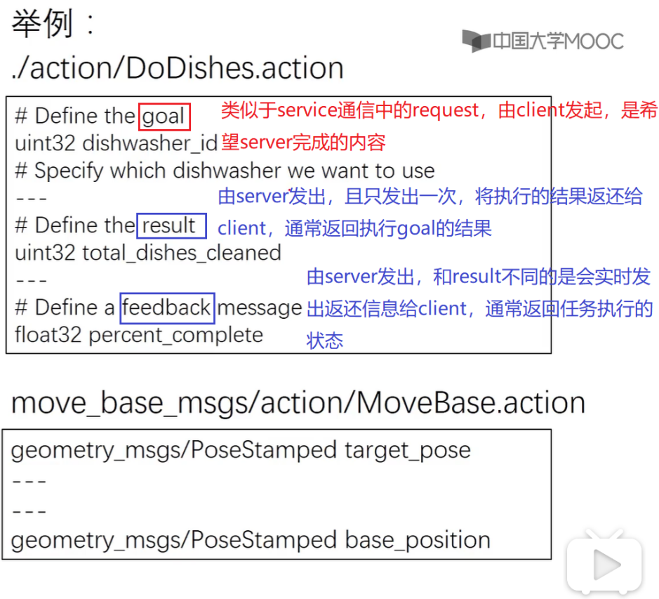<br>
</div>
<br>

## **十、记录和回放数据流的ROS命令行工具——rosbag** ##
可以通过rosbag中的record功能来记录指定的Topic服务中的数据，并将数据保存到*.bag文件，而拿到.bag文件后，就可以通过play功能按照记录时留下的时间戳将数据流进行回放。<br>
记录的原理是创建一个Node来接受数据，并在接受数据的同时给数据打上时间戳。<br>
<br>
<font face="Times New Roman" size=3>命令行记录和回放数据的命令——**rosbag**：</font><br>
<font face="Times New Roman" size=2>记录某些Topic到bag中：**$ rosbag record &#60;*topic-names*&#62;**</font><br>
<font face="Times New Roman" size=2>记录所有Topic到bag中：**$ rosbag record -a**</font><br>
<font face="Times New Roman" size=2>回放bag：**$ rosbag play &#60;*bag-files*&#62;**</font><br>
<br>

# **ROS编程核心** #

## **一、Client Library（用户库）** ##
提供了ROS编程所需的库，例如：建立Node、发布消息、调用服务……<br>

<div align=center>
	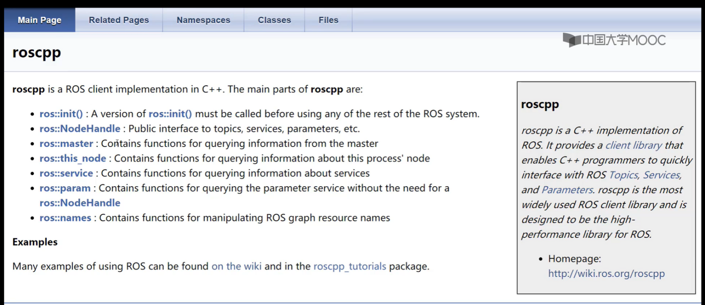<br>
</div>

英文手册网页：[http://docs.ros.org/api/roscpp/html/](http://docs.ros.org/api/roscpp/html/)

<div align=center>
	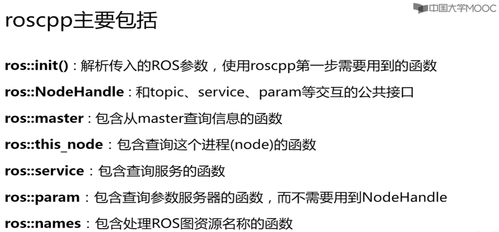<br>
</div>

<div align=center>（对应上面英文手册的中文解释）</div>

以下为上述各类（Class）的具体作用和一些常用的成员函数：<br>
<div align=left>
	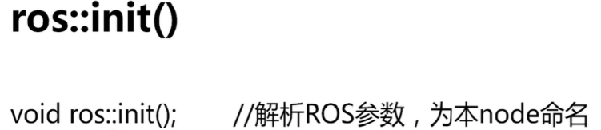<br>
</div>

<div align=left>
	<br>
</div>

<div align=left>
	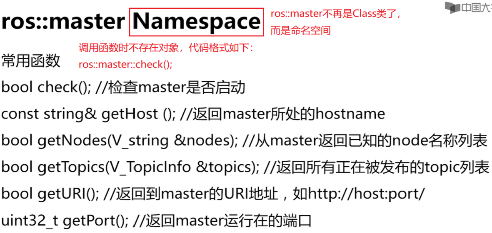<br>
</div>

<div align=left>
	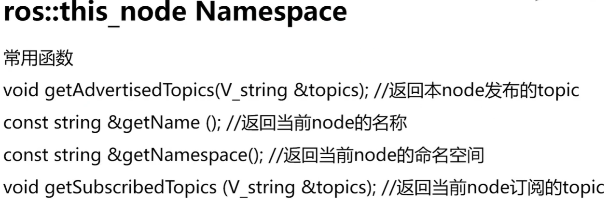<br>
</div>

<div align=left>
	<br>
</div>

<div align=left>
	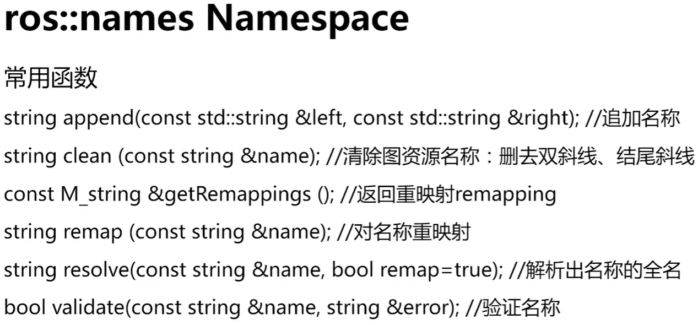<br>
</div>
<br>

## **二、Topic_test的roscpp编写练习** ##
<font face="Times New Roman" size=3>步骤：</font><br>
<font face="Times New Roman" size=4>1.生成package</font><br>
<font face="Times New Roman" size=3>**$ cd ~/ROS-Beginner/catkin_ws/src**</font><br>
<font face="Times New Roman" size=2>（具体的src路径根据自己创建的工作空间路径为主）</font><br>
<font face="Times New Roman" size=3>**$ catkin_create_pkg topic_test roscpp rospy std_msgs**</font><br>
<font face="Times New Roman" size=2>（topic_test是包名，可以根据自己的项目更改，后面所需的依赖也根据自己的实际情况而定）</font><br>
<br>
<font face="Times New Roman" size=4>2.编写msg文件</font><br>
<font face="Times New Roman" size=3>catkin_create_pkg命令执行完成后，会自动生成topic_test目录</font><br>
<font face="Times New Roman" size=3>**$ cd topic_test**</font><br>
<font face="Times New Roman" size=3>Topic通信的数据类型是msg，所以需要创建msg目录来存放*.msg文件</font><br>
<font face="Times New Roman" size=3>**$ mkdir msg**</font><br>
<font face="Times New Roman" size=3>**$ cd msg**</font><br>
<font face="Times New Roman" size=3>因为我的topic是计算距离原点的距离的，所以将msg文件命名为gps，可以根据自己项目的需求对名字进行更改，然后在.msg中写入数据类型</font><br>
<font face="Times New Roman" size=3>**$ vi gps.msg**</font><br>
<font face="Times New Roman" color=blue size=3>
	<strong>
		gps.mag文件中的内容：<br>
		&emsp;&emsp;string status<br>
		&emsp;&emsp;float32 x<br>
		&emsp;&emsp;float32 y<br>
	</strong>
</font>

<font face="Times New Roman" size=3>gps.msg文件是不能拿来直接用的，需要对它进行编译，编译后会生成gps.h头文件，该头文件所在目录：~/ROS-Beginner/catkin_ws/devel/include/topic_test/gps.h</font><br>
<br>
<font face="Times New Roman" size=4>3.修改CMakeList.txt和package.xml文件</font><br>
<font face="Times New Roman" size=3>在进行catkin_make之前，一定要修改CMakeList.txt和package.xml文件中的相关内容，否则gps.h头文件无法成功生成。</font><br>
<font face="Times New Roman" size=3.5>**CMakeList.txt中的修改内容：**</font><br>
<font face="Times New Roman" size=3>(1)指定依赖：在该段内容前面加上“message_generation”这一行，否则是不会生成gps.h文件的</font><br>
<font face="Times New Roman" color=blue size=3>
	find_package(catkin REQUIRED COMPONENTS<br>
	<strong>
		&emsp;&emsp;message_generation<br>
	</strong>
	&emsp;&emsp;roscpp<br>
	&emsp;&emsp;rospy<br>
	&emsp;&emsp;std_msgs<br>
	)<br>
</font>
<font face="Times New Roman" size=3>(2)添加自定义的msg文件：将该段内容前面的“#”全部去掉，“#”表示为注释，添加的msg文件就是package包下的msg文件夹中的所有msg文件</font><br>
<font face="Times New Roman" color=blue size=3>
	add_message_files(<br>
	&emsp;&emsp;FILES<br>
	&emsp;&emsp;gps.msg<br>
	)<br>
</font>
<font face="Times New Roman" size=3>(3)生成msg对应的头文件：将该段内容前面的“#”全部去掉，“#”表示为注释，为了使头文件生成的时候可以链接相关的依赖</font><br>
<font face="Times New Roman" color=blue size=3>
	generate_messages(<br>
	&emsp;&emsp;DEPENDENCIES<br>
	&emsp;&emsp;std_msgs<br>
	)<br>
</font>

<font face="Times New Roman" size=3.5>**package.xml中的修改内容：**</font><br>
<font face="Times New Roman" color=blue size=3>
	&#60;build_depend&#62;message_generation&#60;/build_depend&#62;<br>
	&#60;exec_depend&#62;message_exectime&#60;/exec_depend&#62;<br>
</font>
<font face="Times New Roman" size=3>**$ catkin_make**</font><br>
<font face="Times New Roman" size=3>**$ source ~/ROS-Beginner/catkin_ws/devel/setup.bash**</font><br>
<font face="Times New Roman" size=2>（命令执行结束后，就会在~/ROS-Beginner/catkin_ws/devel/include/topic_test文件夹下看到刚才生成的gps.h头文件了）<br></font><br>
<br>
<font face="Times New Roman" size=4>4.编写talker.cpp文件</font><br>
<font face="Times New Roman" size=3>**$ cd ~ROS-Beginner/catkin_ws/src/topic_test/src**</font><br>
<font face="Times New Roman" size=3>**$ vi talker.cpp**</font><br>
<font face="Times New Roman" color=blue size=3>
	Talker.cpp文件中的内容：<br>
</font>

```C++
#include <ros/ros.h>					//任何ROS的C++程序都必须包含的头文件
#include <topic_test/gps.h>

int main(int argc, char **argv)
{
	ros::init(argc, argv, “talker”);	//argc和argv是解析参数，”talker”是节点的命名名称

	/*handle有把手的意思，所以NodeHandle就像是给我们创建了把手一样，方便我们创建publisher和subscriber*/
	ros::NodeHandle nh;					//创建句柄，实例化node

	/*这里所谓的创建gps消息，其实是对自定义的类似于结构体的msg（这里的msg是指下一行代码中的topic_test::gps msg所定义的变量）进行初始化，因为变量在使用前需要初始化*/
	topic_test::gps msg;				//创建gps消息
	msg.x = 1.0;
	msg.y = 1.0;
	msg.status = “working”;

	/*nh.advertise<>是一个函数模板，而topic_test::gps就是要publish的类型，这个函数有两个参数，第一个是所需要publish的topic的名称，消息在进行publish的时候会先publish到一个队列上，而第二个参数就决定这个队列的长度*/
	ros::Publisher pub = nh.advertise<topic_test::gps>(“gps_info”, 1);		//创建Publisher
	/*这里队列的长度取1，是因为我们这个topic是一读取就发送的*/

	/*因为我们通常不是只发布一条消息，所以需要在while()循环中进行pub.publish()，这样Topic消息就能不停地发布了。ROS里面给我们定义了循环控制的类ros::Rate，这样ROS就可以按照一定的频率发布消息，如下：loop_rate()是创建的循环控制类，而1.0是循环频率，单位是Hz，指一秒发布一个消息*/
	ros::Rate loop_rate(1.0);			//定义循环发布的频率
	/*定义完循环控制类后，就能使用while()循环了*/
	while(ros::ok)						//ros::ok指的是只要ROS还在工作，没有退出
	{
		msg.x = 1.05 * msg.x;			//使坐标x和y每隔1秒以指数增长
		msg.y = 1.1 * msg.y;
		/*这里的ROS_INFO与C语言中的printf()和C++中的cout功能一样，都是在屏幕上打印信息*/
		ROS_INFO(“Talker: GPS: x = %f, y = %f”, msg.x, msg.y);				//输出当前msg
		pub.publish(msg);				//发布消息
		/*ros::Rate loop_rate(1.0)只是定义了循环频率，但要使while()循环按照这一频率运行，必须要配合loop_rate.sleep()一起使用*/
		loop_rate.sleep();				//根据定义的发布频率sleep
	}
	return 0;
}
```

<font face="Times New Roman" size=4>5.编写listener.cpp文件</font><br>
<font face="Times New Roman" size=3>**$ vi listerner.cpp</font><br>
<font face="Times New Roman" color=blue size=3>
	listener.cpp文件中的内容：<br>
</font>

```C++
#include <ros/ros.h>					//任何ROS的C++程序都必须包含的头文件
#include <topic_test/gps.h>
#include <std_msgs/Float32.h>

/*ConstPtr是常指针类型，其声明在<topic_test/gps.h>的头文件里，这里msg消息引用对应的是publish中“topic_test::gps msg”所创建的msg消息*/
void gpsCallback(const topic_test::gps::ConstPtr &msg)
{
	/*回调函数里面的内容就是对接收到的msg消息进行处理*/
	std_msgs::Float32 distance;			//声明一个变量，用来存放坐标到原点的距离
	/*注意：这里我们无论是使用C++中的float类型(float distance)，还是使用ROS自带的float类型(std_msgs::Float32 distance)都是可以的，但是其主要的区别在与下一步，如果使用C++自带的float就直接是”distance =”；如果使用ROS自带的float类型就需要写为”distance.data =”*/
	distance.data = sqrt(pow(msg->x, 2) + pow(msg->y, 2));		//计算坐标到原点的距离
	/*输出距离和状态*/
	ROS_INFO(“Listener: Distance to origin = %f, status = %s”, distance.data, msg->status.c_str());
}

int main(int argc, char **argv)
{
	ros::init(argc, argv, “listener”);	//argc和argv是解析参数，”listener”是节点的命名名称
	ros::NodeHandle n;					//创建句柄，实例化node

	/*n.subscriber()要注意三个参数，第一个参数是我们要监听的Topic，””中的内容必须与上面上面所publish的Topic的名字保持一致；第二个参数是消息接收的队列长度；第三个参数是一个指针，其指向的是处理接收到的消息的回调函数，该函数往往是自定义功能的*/
	ros::Subscriber sub = n.subscribe(“gps_info”, 1, gpsCallback);		//创建subscriber
	/*消息接受的队列长度不用设的太长，因为一般消息接收到后马上就会处理掉，所以这里也和publish的队列长度保持一致，设为1*/

	/*并不是队列中一有消息就会对其进行处理的，必须调用ros::spin()函数，spin()函数会反复查看队列里是否有待处理的消息，队列里有消息就处理，没有就阻塞等待*/
	ros::spin();						//反复调用当前可触发的回调函数，并阻塞
	/*与ros::spin()相对应的函数是ros::spinOnce()，后者是非阻塞函数，只检查一次队列，队列里有消息就处理，没有就直接向下执行程序*/
	return 0;
}
```

<font face="Times New Roman" size=4>6.修改CMakeList.txt</font><br>
<font face="Times New Roman" size=3>在编写玩talker.cpp和listener.cpp之后，还要再修改一次CMakeList.txt，否则ROS无法对cpp文件进行正常的编译和链接</font><br>
<font face="Times New Roman" size=3>**$ cd ../**</font><br>
<font face="Times New Roman" size=3.5>**CMakeList.txt中的修改内容：**</font><br>
<font face="Times New Roman" color=blue size=3>
	include_directories(<br>
	&emsp;&emsp;include<br>
	&emsp;&emsp;${catkin_INCLUDE_DIRS}<br>
	)<br>
</font>

<font face="Times New Roman" color=blue size=3>add_executable(talker src/talker.cpp)</font>&emsp;&emsp;&emsp;&emsp;<font face="Times New Roman" color=green size=2>#生成可执行的目标文件</font><br>
<br>
<font face="Times New Roman" color=green size=2>#必须添加add_dependencies，否则找不到自定义的msg产生的头文件</font><br>
<font face="Times New Roman" color=blue size=3>add_dependencies(talker topic_test_generate_messages_cpp)</font><br>
<font face="Times New Roman" color=blue size=3>target_link_libraries(talker ${catkin_LIBRARIES})</font>&emsp;&emsp;&emsp;&emsp;<font face="Times New Roman" color=green size=2>#链接</font><br>

<font face="Times New Roman" color=blue size=3>add_executable(listener src/listener.cpp)</font>&emsp;&emsp;&emsp;<font face="Times New Roman" color=green size=2>#生成可执行的目标文件</font><br>
<br>
<font face="Times New Roman" color=green size=2>#必须添加add_dependencies，否则找不到自定义的msg产生的头文件</font><br>
<font face="Times New Roman" color=blue size=3>add_dependencies(listener topic_test_generate_messages_cpp)</font><br>
<font face="Times New Roman" color=blue size=3>target_link_libraries(listener ${catkin_LIBRARIES})</font>&emsp;&emsp;&emsp;&emsp;<font face="Times New Roman" color=green size=2>#链接</font><br>

<font face="Times New Roman" size=4>7.catkin_make编译</font><br>
<font face="Times New Roman" size=3>**$ cd ~/ROS-Beginner/catkin_ws**</font><br>
<font face="Times New Roman" size=3>**$ catkin_make**</font><br>
<br>
<font face="Times New Roman" size=3>到此，topic_test就创建且编译完成了，接下来我们就可以通过rosrun来执行talker和listener了。</font><br>
<font face="Times New Roman" size=3>**命令：**</font><br>
<font face="Times New Roman" size=3>**$ roscore**</font><br>
<font face="Times New Roman" size=3>**$ rosrun topic_test talker**</font><br>
<font face="Times New Roman" size=3>**$ rosrun topic_test listener**</font><br>

## **三、Service_test的roscpp编写练习** ##
<font face="Times New Roman" size=3>步骤：</font><br>
<font face="Times New Roman" size=4>1.生成package</font><br>
<font face="Times New Roman" size=3>**$ cd ~/ROS-Beginner/catkin_ws/src**</font><br>
<font face="Times New Roman" size=2>（具体的src路径根据自己创建的工作空间路径为主）</font><br>
<font face="Times New Roman" size=3>**$ catkin_create_pkg service_test roscpp rospy std_msgs**</font><br>
<font face="Times New Roman" size=2>（service_test是包名，可以根据自己的项目更改，后面所需的依赖也根据自己的实际情况而定）</font><br>

<font face="Times New Roman" size=4>2.编写srv文件</font><br>
<font face="Times New Roman" size=3>catkin_create_pkg命令执行完成后，会自动生成service_test目录</font><br>
<font face="Times New Roman" size=3>**$ cd service_test**</font><br>
<font face="Times New Roman" size=3>service通信的数据类型是srv，所以需要创建srv目录来存放*.srv文件</font><br>
<font face="Times New Roman" size=3>**$ mkdir srv**</font><br>
<font face="Times New Roman" size=3>**$ cd srv**</font><br>
<font face="Times New Roman" size=3>因为我的service是完成client和server之间应答交流的，所以将srv文件命名为greeting，可以根据自己项目的需求对名字进行更改，然后在.srv中写入数据类型</font><br>
<font face="Times New Roman" size=3>**$ vi greeting.srv**</font><br>
<font face="Times New Roman" color=blue size=3>
	<strong>
		greeting.srv文件中的内容：<br>
		&emsp;&emsp;string name<br>
		&emsp;&emsp;int32 age<br>
		&emsp;&emsp;---<br>
		&emsp;&emsp;string feedback<br>
	</strong>
</font>
<font face="Times New Roman" size=3>greeting.srv文件是不能拿来直接用的，需要对它进行编译，编译后会生成头文件greeting.h、greetingRequest.h、greetingResponce.h，这些头文件都在所在~/ROS-Beginner/catkin_ws/devel/include/service_test/目录下</font><br>

<font face="Times New Roman" size=4>3.修改CMakeList.txt和package.xml文件</font><br>
<font face="Times New Roman" size=3>在进行catkin_make之前，一定要修改CMakeList.txt和package.xml文件中的相关内容，否则greeting.h、greetingRequest.h、greetingResponce.h这三个头文件无法成功生成。</font><br>
<font face="Times New Roman" size=3.5>**CMakeList.txt中的修改内容：**</font><br>
<font face="Times New Roman" size=3>(1)指定依赖：在该段内容前面加上“message_generation”这一行，否则是不会生成头文件的</font><br>
<font face="Times New Roman" color=blue size=3>
	find_package(catkin REQUIRED COMPONENTS<br>
	<strong>
		&emsp;&emsp;message_generation<br>
	</strong>
	&emsp;&emsp;roscpp<br>
	&emsp;&emsp;rospy<br>
	&emsp;&emsp;std_msgs<br>
	)<br>
</font>
<font face="Times New Roman" size=3>(2)添加自定义的srv文件：将该段内容前面的“#”全部去掉，“#”表示为注释，添加的srv文件就是package包下的srv文件夹中的所有srv文件</font><br>
<font face="Times New Roman" color=blue size=3>
	add_service_files(<br>
	&emsp;&emsp;FILES<br>
	&emsp;&emsp;greeting.srv<br>
	)<br>
</font>
<font face="Times New Roman" size=3>(3)生成srv对应的头文件：将该段内容前面的“#”全部去掉，“#”表示为注释，为了使头文件生成的时候可以链接相关的依赖，因为srv只能嵌套msg文件</font><br>
<font face="Times New Roman" color=blue size=3>
	generate_messages(<br>
	&emsp;&emsp;DEPENDENCIES<br>
	&emsp;&emsp;std_msgs<br>
	)<br>
</font>
<font face="Times New Roman" size=3>(4)添加catkin所需的依赖和库：将()里面的第二和第三行前面的“#”去掉，并且在第三行最后加上“message_exectime”</font><br>
<font face="Times New Roman" color=blue size=3>
	catkin_package(<br>
	&#35; INCLUDE_DIRS include<br>
		&emsp;&emsp;LIBRARIES service_test<br>
		&emsp;&emsp;CATKIN_DEPENDS roscpp rospy std_msgs message_exectime<br>
	&#35; DEPENDS system_lib<br>
	)<br>
</font>

<font face="Times New Roman" size=3.5>package.xml中的修改内容：</font><br>
<font face="Times New Roman" color=blue size=3>
	&#60;build_depend&#62;message_generation&#60;/build_depend&#62;<br>
	&#60;exec_depend&#62;message_exectime&#60;/exec_depend&#62;<br>
</font>
<font face="Times New Roman" size=3>**$ catkin_make**</font><br>
<font face="Times New Roman" size=3>**$ source ~/ROS-Beginner/catkin_ws/devel/setup.bash**</font><br>
<font face="Times New Roman" size=2>（命令执行结束后，就会在~/ROS-Beginner/catkin_ws/devel/include/sevice_test文件夹下看到刚才生成的三个头文件了）</font><br>

<font face="Times New Roman" size=4>4.编写server.cpp文件</font><br>
<font face="Times New Roman" size=3>**$ cd ~ROS-Beginner/catkin_ws/src/service_test/src**</font><br>
<font face="Times New Roman" size=3>**$ vi server.cpp**</font><br>
<font face="Times New Roman" color=blue size=3>
	server.cpp文件中的内容：<br>
</font>

```C++
#include <ros/ros.h>					//任何ROS的C++程序都必须包含的头文件
#include <service_test/greeting.h>
#include <service_test/greetingRequest.h>
#include <service_test/greetingResponse.h>

/*该函数的返回类型为bool，其意义是表示请求是否有被准确地执行，该函数要传入两个参数，分别是Request和Response，这两个类都是在catkin_make时编译器帮我们生成好的*/
bool handle_function(service_test::greeting::Request &req, service_test::greeting::Response &res)
{
	ROS_INFO(“Request from %s with age %d”, req.name.c_str(), req.age);		//显示请求信息
	res.feedback = “Hi ” + req.name + “. I am server!”;	//处理请求，并将返回的语句写入response
	return true;				//返回true，表示正确处理了请求
}

int main(int argc, char **argv)
{
	ros::init(argc, argv, “greeting_server”);			//argc和argv是解析参数
	ros::NodeHandle n;			//创建句柄，实例化node

	/*nh.advertiseService()是一个函数模板，其有两个参数，第一个参数是service服务的名称，这里我取名为”greeting”；第二个参数是一个函数指针，指向具体处理服务的函数，该函数通常是自定义功能的*/
	ros::ServiceServer service = n.advertiseService(“greeting”, handle_function);
	ros::spin();				//反复调用当前可触发的回调函数，并阻塞
	return 0;
}
```

<font face="Times New Roman" size=4>5.编写client.cpp文件</font><br>
<font face="Times New Roman" size=3>$ vi client.cpp</font><br>
<font face="Times New Roman" color=blue size=3>
	client.cpp文件中的内容：<br>
</font>

```C++
#include <ros/ros.h>				//任何ROS的C++程序都必须包含的头文件
#include <service_test/greeting.h>
#include <service_test/greetingRequest.h>
#include <service_test/greetingResponse.h>

int main(int argc, char **argv)
{
	ros::init(argc, argv, “greeting_client”);
	//argc和argv是解析参数，”greeting_server”是节点的命名名称
	ros::NodeHandle nh;				//创建句柄，实例化node

	/*nh.serviceClient<>是一个函数模板，而service_test::greeting就是要service的类型，这个函数只有一个参数，就是所需要申请的service的名称*/
	ros::ServiceClient client = nh.serviceClient<service_test::greeting>(“greeting”);	//创建client

	/*这里所谓的创建申请srv服务的client信息，其实是对自定义的类似于结构体的srv（这里的srv是指下一行代码中的service_test::greeting srv所定义的变量）进行初始化，因为变量在使用前需要初始化*/
	service_test::greeting srv;		//创建申请srv服务的client信息
	srv.request.name = “Martin”;
	srv.request.age = 23;

	if(client.call(srv))
	{
		/*要显示srv.response.feedback里的信息，后面一定到加上.c_str()，否则显示的是乱码*/
		ROS_INFO(“Feedback from server: %s”, srv.response.feedback.c_str());
	}
	else
	{
		ROS_ERROR(“Failed to call service greeting.”);
		return -1;
	}

	return 0;
}
```

<font face="Times New Roman" size=4>6.修改CMakeList.txt</font><br>
<font face="Times New Roman" size=3>在编写玩server.cpp和client.cpp之后，还要再修改一次CMakeList.txt，否则ROS无法对cpp文件进行正常的编译和链接</font><br>
<font face="Times New Roman" size=3>**$ cd ../**</font><br>
<font face="Times New Roman" size=3.5>**CMakeList.txt中的修改内容：**</font><br>
<font face="Times New Roman" color=blue size=3>
	include_directories(<br>
	&emsp;&emsp;include<br>
	&emsp;&emsp;${catkin_INCLUDE_DIRS}<br>
	)<br>
</font>

<font face="Times New Roman" color=blue size=3>add_executable(server src/server.cpp)</font>&emsp;&emsp;&emsp;&emsp;<font face="Times New Roman" color=green size=2>#生成可执行的目标文件</font><br>
<font face="Times New Roman" color=green size=2>#必须添加add_dependencies，否则找不到自定义的srv产生的头文件</font><br>
<font face="Times New Roman" color=blue size=3>add_dependencies(server ${${PROJECT_NAME}_EXPORTED_TARGETS} ${catkin_EXPORTED_TARGETS})</font><br>
<font face="Times New Roman" color=blue size=3>target_link_libraries(server ${catkin_LIBRARIES})</font>&emsp;&emsp;&emsp;&emsp;<font face="Times New Roman" color=green size=2>#链接</font><br>

<font face="Times New Roman" color=blue size=3>add_executable(client src/client.cpp)</font>&emsp;&emsp;&emsp;&emsp;<font face="Times New Roman" color=green size=2>#生成可执行的目标文件</font><br>
<font face="Times New Roman" color=green size=2>#必须添加add_dependencies，否则找不到自定义的srv产生的头文件</font><br>
<font face="Times New Roman" color=blue size=3>add_dependencies(client ${${PROJECT_NAME}_EXPORTED_TARGETS} ${catkin_EXPORTED_TARGETS})</font><br>
<font face="Times New Roman" color=blue size=3>target_link_libraries(client ${catkin_LIBRARIES})</font>&emsp;&emsp;&emsp;&emsp;<font face="Times New Roman" color=green size=2>#链接</font><br>

<font face="Times New Roman" size=4>7.catkin_make编译</font><br>
<font face="Times New Roman" size=3>**$ cd ~/ROS-Beginner/catkin_ws**</font><br>
<font face="Times New Roman" size=3>**$ catkin_make**</font><br>

<font face="Times New Roman" size=3>到此，service_test就创建且编译完成了，接下来我们就可以通过rosrun来执行server和client了。</font><br>
<font face="Times New Roman" size=3>**命令：**</font><br>
<font face="Times New Roman" size=3>**$ roscore**</font><br>
<font face="Times New Roman" size=3>**$ rosrun service_test server**</font><br>
<font face="Times New Roman" size=3>**$ rosrun service_test client**</font><br>

<font face="Times New Roman" color=tan size=2>**注意：server.cpp和client.cpp在ros::init()时所规定的Node名称不能相一致**</font><br>
<font face="Times New Roman" size=3>两种API：ros::param和ros::NodeHandle</font><br>
<font face="Times New Roman" size=3>**ros::param命令：**</font><br>
<font face="Times New Roman" size=3>**获取参数：ros::param::get(“param1”, parameter1);**</font><br>
<font face="Times New Roman" size=3>**设置参数：ros::param::set(“param4”, parameter4);**</font><br>
<font face="Times New Roman" size=3>**检测参数是否存在：ros::param::has(“param5”);**</font><br>
<font face="Times New Roman" size=3>**删除参数：ros::param::del(“param5”);**</font><br>

## **四、param_test的roscpp编写重点** ##
<font face="Times New Roman" size=3>
	<strong>
		ros::NodeHandle命令：<br>
		ros::NodeHandle nh;<br>
		获取参数：nh.getParam(“param2”, parameter2)或nh.param(“param3”, parameter3, 123);<br>
		设置参数：nh.setParam(“param5”, parameter5);<br>
		检测参数是否存在：nh.hasParam(“param6”);<br>
		删除参数：nh.deleteParam(“param6”);<br>
	</strong>
</font>

## **五、TF（坐标系变换）和URDF（统一机器人描述格式）** ##
<font face="Times New Roman" size=3>TF的坐标变换包括位置和姿态，是坐标系数据维护的工具</font><br>

<font face="Times New Roman" size=3>frame之间的TF消息的数据格式是TransformStamped.msg</font><br>
<div align=center>
	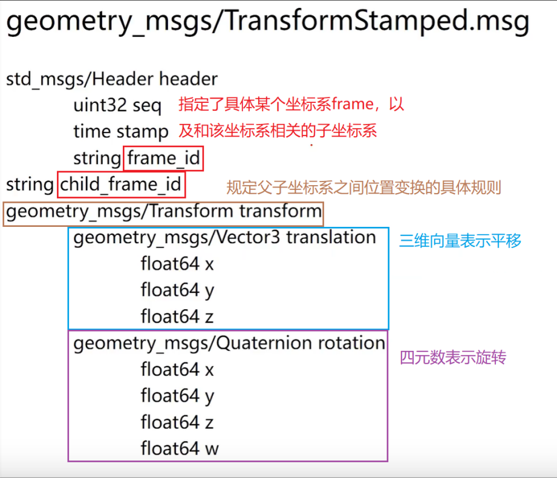<br>
</div>

<font face="Times New Roman" size=3>
	TF消息之间的TF消息的数据格式是：tf/tfMessage.msg（第一代）和tf2_msgs/TFMessage（第二代）<br>
	可以通过命令：<strong>$ rostopic info /tf</strong>来查看用的是哪一代数据格式<br>
</font>
<div align=center>
	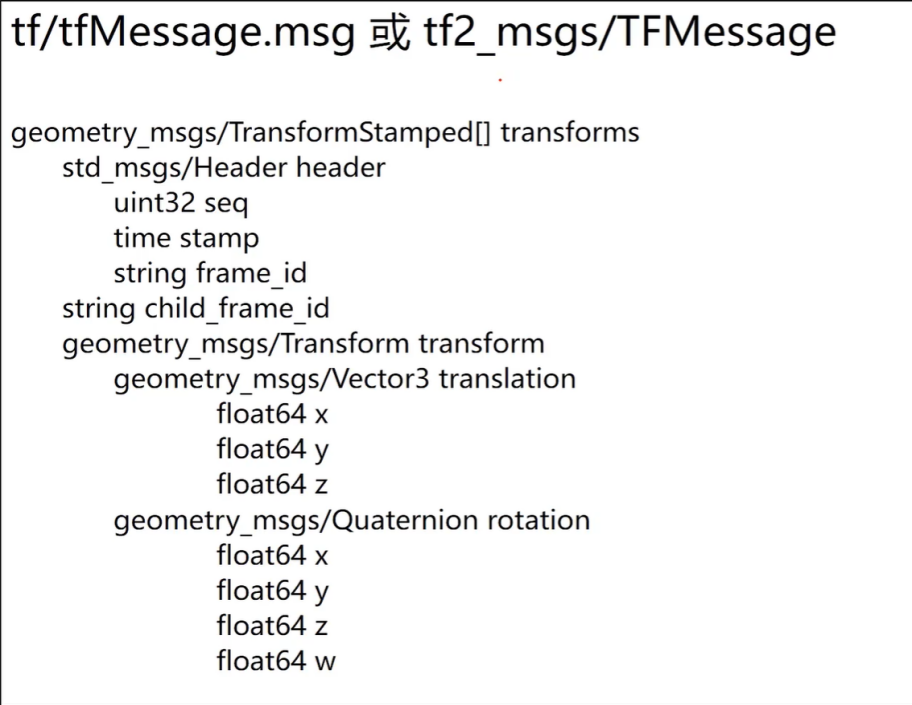<br>
</div>

<font face="Times New Roman" size=3>其实，TF消息之间的TF数据格式就是一组frame之间的TF数据格式，所以仅仅只是将geometry_msgs/TransfromStamped类型数据改为了geometry_msgs/TransfromStamped[]类型的可变长度数组。</font><br>

<font face="Times New Roman" size=3.5>**TF in C++：**</font><br>
<div align=center>
	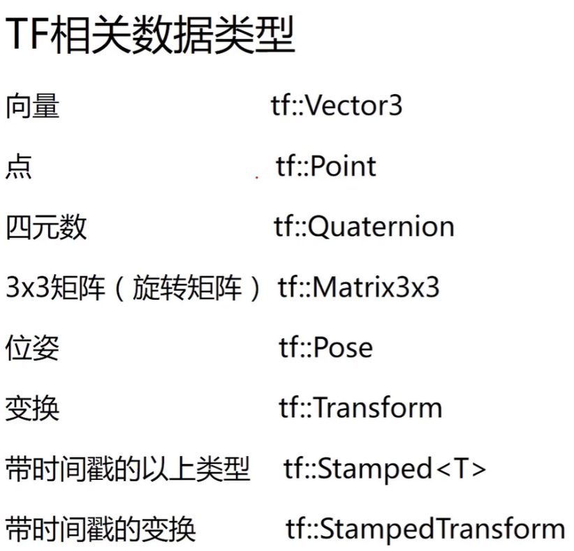<br>
</div>

<div align=center>
	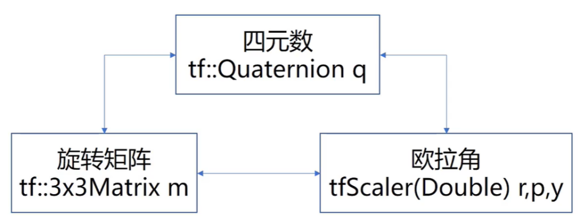<br>
</div>

<div align=center>
	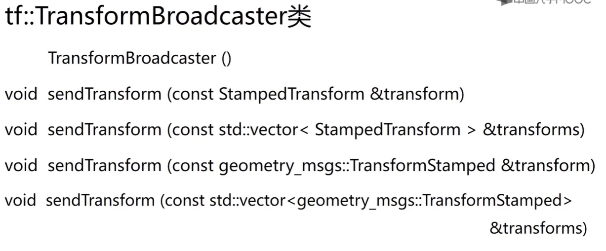<br>
</div>

<div align=center>
	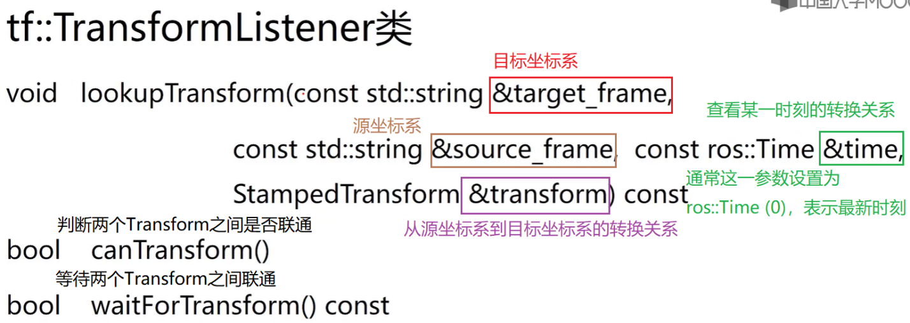<br>
</div>

<font face="Times New Roman" size=3>urdf文件中&#60;link&#62;和&#60;joint&#62;</font><br>

<div align=center>
	<br>
</div>

# **工作案例** #

## **一、基于ROS的openCV人脸识别** ##

<font face="黑体" size=3>
	步骤：<br>
	1.生成package<br>
	<strong>
		$ cd ROS-Beginner/catkin_ws/src<br>
		$ catkin_create_pkg cv_bridge_tutorial_cpp roscpp std_msgs cv_bridge image_transport sensor_msgs<br>
	</strong>
</font>

<font face="黑体" color=tan size=3>**注意：因为涉及到图像传输、openCV接口调用、摄像头传感器，所以需要cv_bridge、image_transport、sensor_msgs这三个依赖**</font><br>

<font face="黑体" size=3>
	2.编写image_publisher.cpp<br>
	<strong>
		$ cd cv_bridge_tutorial_cpp/src<br>
		$ vi sample_cv_bridge_node.cpp<br>
	</strong>
</font>

<font face="黑体" color=tan size=3>**注意：我的工作空间路径：/home/martin/ROS-Beginner/catkin_ws，以下.cpp文件是保存在/home/martin/ROS-Beginner/catkin_ws/src/cv_bridge_tutorial_cpp/src这个目录下**</font><br>
<font face="Times New Roman" color=blue size=3>
	sample_cv_bridge_node.cpp文件中的内容：<br>
</font>

```C++
#include <ros/ros.h>
#include <image_transport/image_transport.h>
#include <cv_bridge/cv_bridge.h>
#include <sensor_msgs/image_encodings.h>
#include <opencv2/objdetect.hpp>
#include <opencv2/imgproc/imgproc.hpp>
#include <opencv2/highgui/highgui.hpp>
#include <opencv2/core.hpp>

using namespace std;
using namespace cv;

CascadeClassifier face_cascade;
static const std::string OPENCV_WINDOW = "Raw Image window";

class Face_Detector
{
	ros::NodeHandle nh_;
	image_transport::ImageTransport it_;
	image_transport::Subscriber image_sub_;
	image_transport::Publisher image_pub_;
public:
	Face_Detector():it_(nh_)
	{
		// Subscribe to input video feed and publish output video feed
		image_sub_ = it_.subscribe("/usb_cam/image_raw", 1, &Face_Detector::imageCb, this);
    	image_pub_ = it_.advertise("/face_detector/raw_image", 1);
		cv::namedWindow(OPENCV_WINDOW);
	}

	~Face_Detector()
	{
		cv::destroyWindow(OPENCV_WINDOW);
	}

	void imageCb(const sensor_msgs::ImageConstPtr& msg)
	{
		cv_bridge::CvImagePtr cv_ptr;
		namespace enc = sensor_msgs::image_encodings;
		try
		{
			cv_ptr = cv_bridge::toCvCopy(msg, sensor_msgs::image_encodings::BGR8);
		}
		catch (cv_bridge::Exception& e)
		{
			ROS_ERROR("cv_bridge exception: %s", e.what());
			return;
		}
		// Draw an example circle on the video stream
		if (cv_ptr->image.rows > 400 && cv_ptr->image.cols > 600)
		{
			detect_faces(cv_ptr->image);
			image_pub_.publish(cv_ptr->toImageMsg());
		}
  	}
  
  	void detect_faces(cv::Mat img)
  	{
    	RNG rng(0xFFFFFFFF);
    	int lineType = 8;
   	 	Mat frame_gray;
    	cvtColor(img, frame_gray, COLOR_BGR2GRAY);
    	equalizeHist(frame_gray, frame_gray);
    	//-- Detect faces
    	std::vector<Rect> faces;
    	face_cascade.detectMultiScale(frame_gray, faces);
    	for (size_t i = 0; i < faces.size(); i++)
    	{
        	Point center(faces[i].x + faces[i].width/2, faces[i].y + faces[i].height/2);
        	ellipse(img, center, Size( faces[i].width/2, faces[i].height/2 ), 0, 0, 360, Scalar( 255, 0, 255 ), 4);
        	//图像，文本，坐标，文字类型，缩放因子，颜色，线宽，线型
        	//putText( img, "WARNING:Face Recognation!", org, rng.uniform(0,8),
        	//rng.uniform(0,100)*0.05+0.05, randomColor(rng), rng.uniform(1, 10), lineType);
        	//putText( img, "WARNING : Face Recognation!", org, rng.uniform(0,8),
        	//1.5, Scalar(0, 255,0 ) , rng.uniform(1, 10), lineType);
		}
   		Point org = Point(40,40);
    	if (faces.size() >= 1) 
		{
       		putText(img, "WARNING: Face Recognation!", org, rng.uniform(0,8), 1.5, Scalar(0, 255,0 ), rng.uniform(1, 10), lineType);
    	}
    	imshow(OPENCV_WINDOW,img);
    	waitKey(3);
	}	
  	
	static Scalar randomColor(RNG& rng)
  	{
    	int icolor = (unsigned) rng;
    	return Scalar(icolor&255, (icolor>>8)&255, (icolor>>16)&255); //移位操作，进而生成不同的颜色
  	}
};
 
int main(int argc, char** argv)
{
	//从命令行读取必要的信息,注意路径
  	CommandLineParser parser(argc, argv, 
		"{help h||}"
		"{face_cascade|/home/martin/ROS-Beginner/catkin_ws/src/cv_bridge_tutorial_cpp/src/haarcascade_frontalface_alt.xml|Path to face cascade.}");
	/*这里的红底灰字是该.cpp文件所在的目录路径，一定要修改，否则人脸识别程序不会正常运行，保存该.cpp程序后，要把haarcascade_frontalface_alt.xml文件也复制到这个目录下，该文件所在目录：/usr/share/opencv/haarcascades目录下（实际目录可能有所不同，建议使用find命令查找文件所在路径）*/
 	parser.about("\nThis program demonstrates using the cv::CascadeClassifier class to detect objects (Face + eyes) in a video stream.\n"
   		"You can use Haar or LBP features.\n\n");
 	parser.printMessage();
	String face_cascade_name = parser.get<String>("face_cascade");
 
  	//-- 1. Load the cascades
 	if(!face_cascade.load(face_cascade_name))
 	{
  		cout << "--(!)Error loading face cascade\n";
  		return -1;
 	};
  	ros::init(argc, argv, "Face_Detector");
  	Face_Detector ic;
  	ros::spin();
  	return 0;
}
```

<font face="黑体" size=3>3.确认并修改CMakeLists.txt文件</font><br>
<font face="黑体" size=3>确认内容：</font><br>
<font face="Times New Roman" color=blue size=3>
	find_package(catkin REQUIRED COMPONENTS<br>
	&emsp;&emsp;cv_bridge<br>
	&emsp;&emsp;image_transport<br>
	&emsp;&emsp;roscpp<br>
	&emsp;&emsp;sensor_msgs<br>
	&emsp;&emsp;std_msgs<br>
	)<br>
</font>
<font face="黑体" size=3>增添内容：</font><br>
<font face="Times New Roman" color=blue size=3>
	find_package(OpenCV REQUIRED)<br>
	<br>
	include_directories(<br>
	<font face="Times New Roman" color=green size=3># include</font><br>
	&emsp;&emsp;${catkin_INCLUDE_DIRS}<br>
	&emsp;&emsp;${OpenCV_INCLUDE_DIRS}<br>
	)<br>
	<br>
	<font face="Times New Roman" color=green size=3># 下面斜体部分的内容必须要保持完全一致</font><br>
	add_executable(sample_cv_bridge_node src/sample_cv_bridge_node.cpp)<br>
	target_link_libraries(sample_cv_bridge_node<br>
	&emsp;&emsp;${catkin_LIBRARIES}<br>
	&emsp;&emsp;${OpenCV_LIBRARIES}<br>
	)<br>
	<br>
	include_directories(${catkin_INCLUDE_DIRS} ${OpenCV_INCLUDE_DIRS})<br>
</font>

<font face="黑体" size=3>4.确认package.xml文件</font><br>
确认内容：<br>
<font face="Times New Roman" color=blue size=3>
	&emsp;&emsp;&#60;buildtool_depend&#62;catkin&#60;/buildtool_depend&#62;<br>
	&emsp;&emsp;&#60;build_depend&#62;cv_bridge&#60;/build_depend&#62;<br>
	&emsp;&emsp;&#60;build_depend&#62;image_transport&#60;/build_depend&#62;<br>
	&emsp;&emsp;&#60;build_depend&#62;roscpp&#60;/build_depend&#62;<br>
	&emsp;&emsp;&#60;build_depend&#62;sensor_msgs&#60;/build_depend&#62;<br>
	&emsp;&emsp;&#60;build_depend&#62;std_msgs&#60;/build_depend&#62;<br>
	&emsp;&emsp;&#60;build_export_depend&#62;cv_bridge&#60;/build_export_depend&#62;<br>
	&emsp;&emsp;&#60;build_export_depend&#62;image_transport&#60;/build_export_depend&#62;<br>
	&emsp;&emsp;&#60;build_export_depend&#62;roscpp&#60;/build_export_depend&#62;<br>
	&emsp;&emsp;&#60;build_export_depend&#62;sensor_msgs&#60;/build_export_depend&#62;<br>
	&emsp;&emsp;&#60;build_export_depend&#62;std_msgs&#60;/build_export_depend&#62;<br>
	&emsp;&emsp;&#60;exec_depend&#62;cv_bridge&#60;/exec_depend&#62;<br>
	&emsp;&emsp;&#60;exec_depend&#62;image_transport&#60;/exec_depend&#62;<br>
	&emsp;&emsp;&#60;exec_depend&#62;roscpp&#60;/exec_depend&#62;<br>
	&emsp;&emsp;&#60;exec_depend&#62;sensor_msgs&#60;/exec_depend&#62;<br>
	&emsp;&emsp;&#60;exec_depend&#62;std_msgs&#60;/exec_depend&#62;<br>
</font>

<font face="黑体" size=3>
	5.catkin_make<br>
	<strong>
		$ cd ~/ROS-Beginner/catkin_ws<br>
		$ catkin_make<br>
		$ source devel/setup.bash<br>
	</strong>
</font>

<font face="黑体" size=3>
	6.运行package<br>
	打开一个新终端，输入命令：<strong>$ roscore</strong><br>
	再打开一个新终端，输入命令：<strong>$ roslaunch usb_cam usb_cam-test.launch</strong><br>
	在打开一个新终端，输入命令：<strong>$ rosrun cv_bridge_tutorial_cpp sample_cv_bridge_node</strong><br>
</font>
<br>
<font face="Times New Roman" color=tan size=3>
	注意：自定定义的usb摄像头的package不要命名为usb_cam，因为这样会使得rosrun运行节点时，ROS编译器无法正常运行节点，因为其无法分清楚命令需要运行的究竟是ROS自带的usb_cam包还是我们自定义的usb_cam包。<br>
</font>