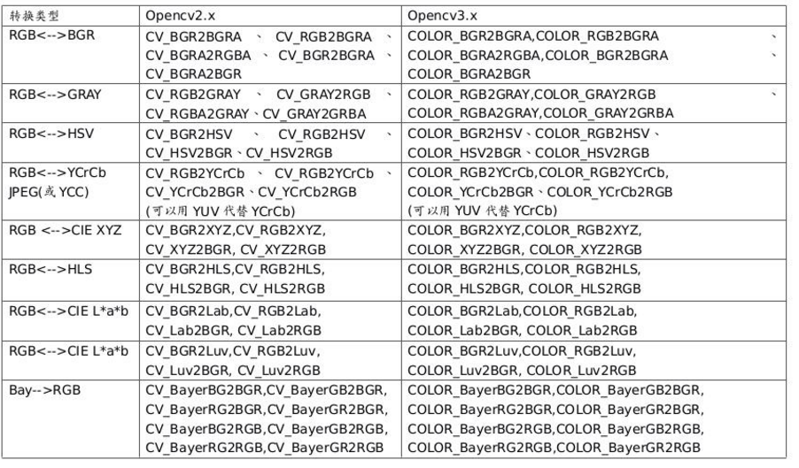

<div align=center>
	<font face="黑体" size=5>目录</font><br>
</div>

<!-- TOC -->

- [OpenCV基础学习——头文件](#opencv基础学习头文件)
    - [**一、<opencv2/imgproc/imgproc.hpp>和<opencv2/imgproc.hpp>所包含的类与函数基本相同**](#一opencv2imgprocimgprochpp和opencv2imgprochpp所包含的类与函数基本相同)
    - [**二、<opencv2/highgui/highgui.hpp>和<opencv/highgui.hpp>所包含的类与函数基本相同**](#二opencv2highguihighguihpp和opencvhighguihpp所包含的类与函数基本相同)
    - [**三、<opencv2/objdetect/objdetect.hpp>和<opencv2/objdetect.hpp>所包含的类与函数基本相同**](#三opencv2objdetectobjdetecthpp和opencv2objdetecthpp所包含的类与函数基本相同)
    - [**四、<opencv2/opencv.hpp>所包含的类与函数如下**](#四opencv2opencvhpp所包含的类与函数如下)
    - [**五、<opencv2/core.hpp>是一个完全可有可无的头文件，包含与否都不会影响程序的编译，就是个废物**](#五opencv2corehpp是一个完全可有可无的头文件包含与否都不会影响程序的编译就是个废物)
- [OpenCV基础学习——函数与类的解析](#opencv基础学习函数与类的解析)
    - [**一、OpenCV基本的图像和视频读写函数与类**](#一opencv基本的图像和视频读写函数与类)
- [ROS人脸识别代码解读](#ros人脸识别代码解读)
- [Haar级联分类器的选择](#haar级联分类器的选择)
- [ROS人脸识别信息的Topic传输](#ros人脸识别信息的topic传输)

<!-- /TOC -->

# OpenCV基础学习——头文件 #

## **一、<opencv2/imgproc/imgproc.hpp>和<opencv2/imgproc.hpp>所包含的类与函数基本相同** ##
1. <font size=3>cvtColor()函数的第三个图像类型转换参数</font>
<div align=center>
	<br>
</div>

2. <font size=3>cvtColor()函数：用来实现图像颜色类型之间的转换（RGB、HSV、HSI、lab、YUV），以及彩色和黑白之间的转换</font>
3. <font size=3>CV_RGB()宏：用来创建RGB颜色格式的色彩值</font>
4. <font size=3>circle()函数：用来在图像上绘制圆</font>
5. <font size=3>equalizeHist()函数：用来完成直方图均衡化操作，目的是提高图像的质量</font>

## **二、<opencv2/highgui/highgui.hpp>和<opencv/highgui.hpp>所包含的类与函数基本相同** ##
1. <font size=3>imread()函数：用来读取图像</font>
2. <font size=3>imshow()函数：用来显示图像</font>
3. <font size=3>waitKey()函数：用来等待按键</font>
4. <font size=3>namedWindow()函数：用来创建OpenCV显示图像的窗口</font>

## **三、<opencv2/objdetect/objdetect.hpp>和<opencv2/objdetect.hpp>所包含的类与函数基本相同** ##
1. <font size=3>cascadeClassifier类：OpenCV做人脸识别所需要用到的联级分类器</font><br>
<font face="Times New Roman" color=tan size=2>*用法——cascadeClassifier cascade;*</font>

## **四、<opencv2/opencv.hpp>所包含的类与函数如下** ##
<font face="Times New Roman" color=red size=2>**※注意：&#60;opencv2/opencv.hpp&#62;可以称得上是万能头文件，它可以完美替代&#60;opencv2/imgproc.hpp&#62;、&#60;opencv/highgui.hpp&#62;和&#60;opencv2/objdetect.hpp&#62;**</font>

1. <font size=3>VideoCapture类：用来处理从video文件、图像流或者摄像头获取的视频</font><br>
<font face="Times New Roman" color=tan size=2>*用法——VideoCapture cap;*</font>

2. <font size=3>CV_RGB()宏：用来创建RGB颜色格式的色彩值</font>

3. <font size=3>Scalar()函数：用来显示不同的颜色</font>

4. <font size=3>cvtColor()函数：用来实现图像颜色类型之间的转换（RGB、HSV、HSI、lab、YUV），以及彩色和黑白之间的转换</font>

5. <font size=3>cvtColor()函数的第三个图像类型转换参数</font>
<div align=center>
	<br>
</div>

6. <font size=3>circle()函数：用来在图像上绘制圆</font>

7. <font size=3>equalizeHist()函数：用来完成直方图均衡化操作，目的是提高图像的质量</font>

8. <font size=3>imread()函数：用来读取图像</font>

9. <font size=3>imshow()函数：用来显示图像</font>

10. <font size=3>waitKey()函数：用来等待按键</font>

11. <font size=3>namedWindow()函数：用来创建OpenCV显示图像的窗口</font>

12. <font size=3>cvRound()函数：用来获得跟参数最接近的整数值，即四舍五入</font>

13. <font size=3>cascadeClassifier类：OpenCV做人脸识别所需要用到的联级分类器</font><br>
<font face="Times New Roman" color=tan size=2>*用法——cascadeClassifier cascade;*</font><br>

14. <font size=3>Mat类：该类由两个数据部分构成，分别是矩阵头（包含矩阵尺寸、存储方法、存储地址等等）和一个指向存储所有像素的矩阵的指针</font><br>
<font face="Times New Roman" color=tan size=2>*用法——Mat color_img;*</font><br>

15. <font size=3>vector类：用来动态地生成一个数组</font><br>
<font face="Times New Roman" color=tan size=2>*用法——vector <int> a;等同于：int a[];*</font><br>

16. <font size=3>Point类：用来确定二维图像或者三维图像中点的具体位置</font>

## **五、<opencv2/core.hpp>是一个完全可有可无的头文件，包含与否都不会影响程序的编译，就是个废物** ##

# OpenCV基础学习——函数与类的解析 #

## **一、OpenCV基本的图像和视频读写函数与类** ##
1、<font face="Times New Roman" color=red size=3>**imread()函数：**</font><font size=3>用来打开图像，并以矩阵格式存储图像</font><br>
<font size=3>imread()的两个参数——</font><br>
<font size=3>&emsp;&emsp;(1)包含图像路径的字符串</font><br>
<font size=3>&emsp;&emsp;(2)可选参数flag</font><br>
<font size=3>&emsp;&emsp;&emsp;&emsp;flag=1：按三通道的方式读入图像，即彩色图像</font><br>
<font size=3>&emsp;&emsp;&emsp;&emsp;flag=0：按单通道的方式读入图像，即灰白图像</font><br>
<font size=3>&emsp;&emsp;&emsp;&emsp;flag=-1：imread按解码得到的方式读入图像</font><br>

2、<font face="Times New Roman" color=red size=3>**imwrite()函数：**</font><font size=3>用来存储图像</font><br>
<font size=3>imwrite()的两个参数——</font><br>
<font size=3>&emsp;&emsp;(1)带有所需扩展格式的图像保存路径（该路径是相对于本源文件所在的文件夹为起始地址的）</font><br>
<font size=3>&emsp;&emsp;(2)想要保存的矩阵图像</font><br>

3、<font face="Times New Roman" color=red size=3>**imshow()函数：**</font><font size=3>用来创建一个窗口，并在窗口中显示指定的图像</font><br>
<font size=3>imshow()的两个参数——</font><br>
<font size=3>&emsp;&emsp;(1)窗口上显示的标题字符出</font><br>
<font size=3>&emsp;&emsp;(2)想要显示的图像矩阵</font><br>
<font face="Times New Roman" color=tan size=2.5>
	<strong>
		※注意：imshow()函数后面必须立马跟随waitKey()函数，否则图像和视频无法正常显示在窗口上，下列形式也是错误的。<br>
		&emsp;&emsp;imshow(“Video”, frame);<br>
		&emsp;&emsp;if (waitKey(30) >= 0)<br>
		&emsp;&emsp;{<br>
		&emsp;&emsp;&emsp;&emsp;break;<br>
		&emsp;&emsp;}<br>
	</strong>
</font>

4、<font face="Times New Roman" color=red size=3>**waitKey()函数：**</font><font size=3>等待按键</font><br>
<font size=3>waitKey()的一个参数——</font><br>
<font size=3>&emsp;&emsp;(1)设置要等待的毫秒数，如果将这一参数设置为0，表示将永远等待</font><br>

5、<font face="Times New Roman" color=red size=3>**namedWindow()函数：**</font><font size=3>用来创建一个显示窗口</font><br>
<font size=3>namedWindow()的两个参数——</font><br>
<font size=3>&emsp;&emsp;(1)新建的窗口名称，可以自己随便去</font><br>
<font size=3>&emsp;&emsp;(2)窗口的标识flag，可以默认缺省，一般默认是WINDOW_AUTOSIZE</font><br>
<font size=3>&emsp;&emsp;&emsp;&emsp;WINDOW_AUTOSIZE：窗口大小自适应图片大小，并且不可手动更改</font><br>
<font size=3>&emsp;&emsp;&emsp;&emsp;WINDOW_NORMAL：用户可以改变这个窗口大小</font><br>
<font size=3>&emsp;&emsp;&emsp;&emsp;WINDOW_OPENGL：窗口创建的时候支持OpenGL</font><br>

6、<font face="Times New Roman" color=red size=3>**cvtColor()函数：**</font><font size=3>用来实现图像颜色类型之间的转换（RGB、HSV、HSI、lab、YUV），以及彩色和黑白之间的转换</font><br>
<font size=3>cvtColor()的四个参数——</font><br>
<font size=3>&emsp;&emsp;(1)InputArray src：输入图像即要进行颜色空间变换的原图像，通常是Mat类</font><br>
<font size=3>&emsp;&emsp;(2)OutputArray dst：输出图像即进行颜色空间变换后存储图像，通常是Mat类</font><br>
<font size=3>&emsp;&emsp;(3)int code：转换的代码或标识，即在此确定将什么制式的图片转换成什么制式的图片</font><br>
<font size=3>&emsp;&emsp;(4)int dstCn = 0：目标图像通道数，通常取值为0（若取值为0，则由src和code决定）</font><br>

7、<font face="Times New Roman" color=red size=3>**circle()函数：**</font><font size=3>用来在图像上绘制圆</font><br>
<font size=3>circle()的五个参数——</font><br>
<font size=3>&emsp;&emsp;(1)img：所需要绘制圆的目标图像</font><br>
<font size=3>&emsp;&emsp;(2)center：圆心坐标</font><br>
<font size=3>&emsp;&emsp;(3)radius：圆的半径</font><br>
<font size=3>&emsp;&emsp;(4)color：Scalar类型，表示圆的颜色，例如蓝色为Scalar(255, 0, 0)</font><br>
<font size=3>&emsp;&emsp;(5)thickness：线的宽度</font><br>

8、<font face="Times New Roman" color=red size=3>**cvRound()函数：**</font><font size=3>用来获得跟参数最接近的整数值，即四舍五入</font><br>
<font size=3>cvRound()的一个参数——</font><br>
<font size=3>&emsp;&emsp;(1)value：实数值，例如cvRound(3.7) = 4、cvRound(-2.6) = -3</font><br>

9、<font face="Times New Roman" color=red size=3>**equalizeHist()函数：**</font><font size=3>用来完成直方图均衡化操作，目的是提高图像的质量</font><br>
<font size=3>equalizeHist()的两个参数——</font><br>
<font size=3>&emsp;&emsp;(1)inputArray src：需要进行直方图均衡化操作的图像序列</font><br>
<font size=3>&emsp;&emsp;(2)outputArray dst：用来存放完成均衡操作图像的序列</font><br>

10、<font face="Times New Roman" color=purple size=3>**Mat类：**</font><font size=3>该类由两个数据部分构成，分别是矩阵头（包含矩阵尺寸、存储方法、存储地址等等）和一个指向存储所有像素的矩阵的指针</font><br>
<font size=3>成员变量编写案例：</font><br>
<strong>
	<font face="Times New Roman">
		<font color=blue size=3>&emsp;&emsp;Mat color_img;</font>&emsp;&emsp;&emsp;&emsp;<font color=green size=3>*//定义一个Mat类型的图像矩阵*</font><br>
		<font color=blue size=3>&emsp;&emsp;color_img.cols;</font>&emsp;&emsp;&emsp;&emsp;<font color=green size=3>*//矩阵的列数*</font><br>
		<font color=blue size=3>&emsp;&emsp;color_img.rows;</font>&emsp;&emsp;&emsp;&emsp;<font color=green size=3>*//矩阵的行数*</font><br>
		<font color=blue size=3>&emsp;&emsp;color_img.data;</font>&emsp;&emsp;&emsp;&emsp;<font color=green size=3>*//指向矩阵color_img数据单元的指针*</font><br>
		<font color=blue size=3>&emsp;&emsp;color_img.dims;</font>&emsp;&emsp;&emsp;&emsp;<font color=green size=3>*//矩阵的维度，该值≥2*</font><br>
		<font color=blue size=3>&emsp;&emsp;color_img.size;</font>&emsp;&emsp;&emsp;&emsp;<font color=green size=3>*//矩阵大小*</font><br>
	</font>
</strong>
<font size=3>成员函数编写案例：</font><br>
<strong>
	<font face="Times New Roman">
		<font color=blue size=3>&emsp;&emsp;color_img.cols();</font>&emsp;&emsp;&emsp;&emsp;<font color=green size=3>*//获取图片的高度*</font><br>
		<font color=blue size=3>&emsp;&emsp;color_img.rows();</font>&emsp;&emsp;&emsp;&emsp;<font color=green size=3>*//获取图片的宽度*</font><br>
		<font color=blue size=3>&emsp;&emsp;color_img.depth();</font>&emsp;&emsp;&emsp;&emsp;<font color=green size=3>*//获取图像位深度，即矩阵元素的存储方式（存储每个像素所用的位数）*</font><br>
	</font>
</strong>
<font size=3>&emsp;&emsp;&emsp;&emsp;图像位深度 = 比特数 + 数据类型</font><br>

|图像深度|空间大小|范围|等同C++变量|
|:--:|:--:|:--:|:--:|
|CV_8U|8bits|0~255|unsigned char|
|CV_8S|8bits|-128~127|char|
|CV_16U|16bits|0~66535|unsigned short, unsigned int|
|CV_16S|16bits|-32768~32767|short, short int|
|CV_32S|32bits|-2147483648~2147483647|int, long|
|CV_32F|32bits|1.18E-38~3.40E38|float|
|CV_64F|64bits|2.23E-308~1.79E308|double|

<font face="Times New Roman" color=blue size=3>&emsp;&emsp;**color_img.channels();**</font>&emsp;&emsp;&emsp;&emsp;<font color=green size=3><strong>*//获取矩阵通道的数目*</strong></font><br>
<font size=2.5>&emsp;&emsp;**函数原型：int Mat:channels()**</font><br>
<font face="Times New Roman" color=blue size=3>&emsp;&emsp;**color_img.type();**</font>&emsp;&emsp;&emsp;&emsp;<font color=green size=3><strong>*//获取存储矩阵元素的数据类型（包括位深度、通道数、数据类型）*</strong></font><br>
<font size=2.5>&emsp;&emsp;**函数原型：int Mat:type()**</font><br>
<font size=3>&emsp;&emsp;&emsp;&emsp;存储数据的数据类型格式：CV_[位数][带符号与否]</font><font color=red size=3>[类型前缀]C</font><font size=3>[通道数]</font><br>
<font size=3>&emsp;&emsp;&emsp;&emsp;带符号与否——S为符号整数，U为无符号整数，F为浮点数</font><br>
<font size=3>&emsp;&emsp;&emsp;&emsp;举例——CV_8UC3</font><br>
<font size=3>&emsp;&emsp;&emsp;&emsp;数据类型—返回值 对照表：</font><br>

|行：通道数<br>列：图像深度|C1|C2|C3|C4|
|:--:|:--:|:--:|:--:|:--:|
|CV_8U|0|8|16||24|
|CV_8S|1|9|17|25|
|CV_16U|2|10|18|26|
|CV_16S|3|11|19|27|
|CV_32S|4|12|20|28|
|CV_32F|5|13|21|29|
|CV_64F|6|14|22|30|
|用户定义|7||||	

<font size=3>创建二维Mat对象格式：</font><br>
<font size=3>&emsp;&emsp;Mat Matrix_name(行数, 列数, 存储元素的数据类型, 每个矩阵点的通道数)</font><br>

11、<font face="Times New Roman" color=purple size=3>**CommandLineParse类：**</font><font size=3>命令行解析器类，用来管理输入的命令行参数</font><br>
<font size=3>编写案例：</font><br>
<font face="Times New Roman" color=blue size=3>
	<strong>
		&emsp;&emsp;const char* keys =<br> 
		&emsp;&emsp;{<br>
		&emsp;&emsp;&emsp;&emsp;“{help h usage ? | | print this message}”<br>
		&emsp;&emsp;&emsp;&emsp;“{@video | | video file, if not defined try to use webcamera}”<br>
		&emsp;&emsp;&emsp;&emsp;“{fps | -1.0 | fps for output video}”<br>
		&emsp;&emsp;};<br>
	</strong>
</font>
<font size=3>每一行的模式：</font><br>
<font face="Times New Roman" size=3>&emsp;&emsp;{命令(name_param) | 默认值(default_value) | 提示(description)}</font><br>
<font size=3>细节说明：</font><br>
<font face="Times New Roman" size=3>
	&emsp;&emsp;(1)@表示按照顺序出现在exe后面，程序会根据出现顺序赋值给各个变量<br>
	&emsp;&emsp;(2)非@参数使用“=”运算符，如fps=60<br>
	&emsp;&emsp;(3)非@参数可以使用-或者--开头，如：-fps=60或--fps=60<br>
	&emsp;&emsp;(4)同一参数可以有多个别名称对应，如：help h usage ?，四个表达都可以显示帮助信息<br>
</font>
<font size=3>命令行案例：</font><br>
<font face="Times New Roman" size=3>
	&emsp;&emsp;./exe&#32;&#32;-help<br>
	&emsp;&emsp;./exe&#32;&#32;/dev/video0<br>
	&emsp;&emsp;./exe&#32;&#32;-fps=50<br>
	&emsp;&emsp;./exe&#32;&#32;/dev/video0&#32;&#32;-fps=60<br>
</font>
<font color=tan size=2.5>**※注意：如果想要使用多个name_param，需要在源程序的主函数中添加：CommandLineParser parser(argc, argv, keys);**</font><br>
<font size=3>parser.about()函数：用来进行命令的说明，一般是程序的功能，以及参数的用法</font><br>
<font size=3>编写案例：</font><br>
<font face="Times New Roman" color=blue size=3>&emsp;&emsp;**parser.about(practice2. v1.0.0)**</font><br>
<font size=3>parser.has()函数：用来检查参数是否存在</font><br>
<font size=3>parser.printMessage()函数：用来显示所有描述参数</font><br>
<font size=3>编写案例：</font><br>
<font face="Times New Roman" color=blue size=3>
	<strong>
		&emsp;&emsp;if (parser.has(“help”))&emsp;&emsp;&emsp;&emsp;<font color=green>*//检查用户是否已经在命令行中添加-help或-？*</font><br>
		&emsp;&emsp;{<br>
		&emsp;&emsp;&emsp;&emsp;parser.printMessage();&emsp;&emsp;<font color=green>*//打印about中的信息*</font><br>
		&emsp;&emsp;&emsp;&emsp;......&emsp;&emsp;&emsp;&emsp;&emsp;&emsp;&emsp;&emsp;&emsp;<font color=green>*//具体if执行的程序代码*</font><br>
		&emsp;&emsp;&emsp;&emsp;return 0;<br>
		&emsp;&emsp;}<br>
	</strong>
</font>
<font size=3>parser.get&#60;typename&#62;(parameterName)函数：用来访问和读取任何输入参数</font><br>
<font size=3>编写案例：</font><br>
<font face="Times New Roman" size=3>
	<strong>
		&emsp;&emsp;<font color=green>*//将命令行中，参数名称N后面的值以int的形式存放到变量N中*</font><br>
		&emsp;&emsp;<font color=blue>int N = parser.get&#60;int&#62;(“N”);</font><br>
		&emsp;&emsp;<font color=green>*//将命令行中，参数名称fps后面的值以double的形式存放到变量fps中*</font><br>
		&emsp;&emsp;<font color=blue>double fps = parser.get&#60;double&#62;(“fps”);</font><br>
		&emsp;&emsp;<font color=green>*//将命令行中，第0个参数开始，满足String的值放到变量videoFile中*</font><br>
		&emsp;&emsp;<font color=blue>String videoFile = parser.get&#60;String&#62;(0);</font><br>
	</strong>
</font>
<font color=tan size=2.5>&emsp;&emsp;**※注意：命令行参数的计数是从0开始的，也就是从命令行最开始的参数往后依次进行排查。**</font><br>
<font size=3>parser.check()函数：用来检测参数在使用前是否有解析错误的现象</font><br>
<font size=3>parser.printErrors()函数：用来显示错误信息（这些错误是库中已经列出的）</font><br>
<font size=3>编写案例：</font><br>
<font face="Times New Roman" size=3 color=blue>
	<strong>
		&emsp;&emsp;if (!parser.check())&emsp;&emsp;&emsp;&emsp;<font color=green>*//检测参数是否有解析错误（返回类型是bool）*</font><br>
		&emsp;&emsp;{<br>
		&emsp;&emsp;&emsp;&emsp;Parser.printErrors();&emsp;&emsp;<font color=green>*//打印错误信息*</font><br>
		&emsp;&emsp;&emsp;&emsp;......&emsp;&emsp;&emsp;&emsp;&emsp;&emsp;&emsp;&emsp;&emsp;<font color=green>*//具体if执行的程序代码*</font><br>
		&emsp;&emsp;&emsp;&emsp;return 0;<br>
		&emsp;&emsp;}<br>
	</strong>
</font>

12、<font face="Times New Roman" color=purple size=3>**Point类：**</font><font size=3>用来确定二维图像或者三维图像中点的具体位置</font><br>
<font face="Times New Roman" size=3>
	编写案例：<br>
	<font color=blue>&emsp;&emsp;**Point center;**</font><br>
	成员变量：<br>
	<strong>
		&emsp;&emsp;<font color=tan>※注意：如果是二维图像，就只有x和y两个成员变量，只有三维图像才会有z</font><br>
	</strong>
	&emsp;&emsp;center.x——点的x坐标，可以是int类型、float类型，以及double类型<br>
	&emsp;&emsp;center.y——点的y坐标，可以是int类型、float类型，以及double类型<br>
	&emsp;&emsp;center.z——点的z坐标，可以是int类型、float类型，以及double类型<br>
</font>

13、<font face="Times New Roman" color=purple size=3>**vector类：**</font><font size=3>用来动态地生成一个数组</font><br>
<font face="Times New Roman" size=3>
	编写案例：<br>
	<strong>
		&emsp;&emsp;<font color=blue>vector<Rect> faces;</font>&emsp;&emsp;&emsp;&emsp;<font color=green>*//Rect是OpenCV中的数据类型*</font><br>
	</strong>
	成员函数：<br>
	&emsp;&emsp;(1)faces.empty()：判断数组是否为空<br>
	&emsp;&emsp;(2)faces.erase(pos)：删除pos位置的数据<br>
	&emsp;&emsp;(3)faces.erase(beg, end)：删除[beg,end)区间的数据<br>
	&emsp;&emsp;(4)faces.front()：传回第一个数据<br>
	&emsp;&emsp;(5)faces.insert(pos, elem)：在pos位置插入一个数据elem<br>
	&emsp;&emsp;(6)faces.pop_back()：删除最后一个数据<br>
	&emsp;&emsp;(7)faces.push_back(elem)：在尾部加入一个数据<br>
	&emsp;&emsp;(8)faces.resize(num)：重新设置该容器的大小<br>
	&emsp;&emsp;(9)faces.size()：返回容器中实际数据的个数<br>
	&emsp;&emsp;(10)faces.begin()：返回指向容器第一个元素的迭代器<br>
	&emsp;&emsp;(11)faces.end()：返回指向容器最后一个元素的迭代器<br>
</font>

14、<font face="Times New Roman" color=purple size=3>**VideoCapture类：**</font><font size=3>用来处理从video文件、图像流或者摄像头获取的视频</font><br>
<font face="Times New Roman" size=3>
	编写案例：<br>
	<font color=blue>&emsp;&emsp;**VideoCapture cap;**</font><br>
	cap.open()函数：用来打开video文件或视频捕捉设备来获取视频<br>
	编写案例：<br>
	<strong>
		<font color=green>&emsp;&emsp;*//打开和videoFile变量存储的String类型字符串一样的video文件*</font><br>
		<font color=blue>&emsp;&emsp;cap.open(videoFile);</font><br>
		<font color=green>&emsp;&emsp;*//打开/dev文件夹下的video0文件，()中的编号，就是/dev文件夹下正在使用的video文件编号*</font><br>
		<font color=blue>&emsp;&emsp;cap.open(0);</font><br>
	</strong>
	cap.isOpened()函数：用来判断video文件是否初始化启动成功，成功返回true<br>
	编写案例：<br>
	<strong>
		<font color=blue>&emsp;&emsp;if (!cap.isOpened())</font>&emsp;&emsp;&emsp;&emsp;<font color=green>*//判断摄像头设备是否成功打开*</font><br>
		<font color=blue>&emsp;&emsp;{</font><br>
		<font color=blue>&emsp;&emsp;&emsp;&emsp;......</font>&emsp;&emsp;&emsp;&emsp;&emsp;&emsp;&emsp;&emsp;<font color=green>*//具体if执行的程序代码*</font><br>
		<font color=blue>&emsp;&emsp;}</font><br>
	</strong>
	cap.release()函数：用来关闭video文件和视频捕捉设备<br>
	编写案例：<br>
	<font color=blue>&emsp;&emsp;cap.release();</font>&emsp;&emsp;&emsp;&emsp;&emsp;&emsp;<font color=green>*//释放摄像头和视频cap*</font><br>
	<font color=tan>&emsp;&emsp;**※注意：在计算机视觉应用中释放所有资源是非常重要的；如果不这么做，RAM内存会被全部消耗掉**</font><br>
</font>

# ROS人脸识别代码解读 #

```C++
main.cpp文件中的内容：
#include <ros/ros.h>
#include <image_transport/image_transport.h>
#include <sensor_msgs/image_encodings.h>
#include <cv_bridge/cv_bridge.h>

#include <opencv2/core.hpp>
#include <opencv2/highgui/highgui.hpp>
#include <opencv2/objdetect.hpp>
#include <opencv2/imgproc/imgproc.hpp>

using namespace std;
//cv是基于C++的OpenCV的命名空间
/*
*使用该命名空间必须包含以下两个头文件：
*1、#include <opencv2/highgui/highgui.hpp>
*2、#include <opencv2/core.hpp>
*这里调用命名空间cv，是因为后面调用了namedWindow()、destroyWindow()函数
*/
using namespace cv;

//OpenCV做人脸识别所需要用到的联级分类器
CascadeClassifier face_cascade;

//定义全局的静态const类型的字符串变量，并初始化为“Raw Image window”，用来命名OpenCV显示图像的窗口
/*
*因为这个变量在整个人脸识别Node运行的过程中都要使用到的，且不能被改变的，所以定义为static const类型
*/
static const string OPENCV_WINDOW = "Raw Image window";

class Face_Detector
{
	//创建一个与topic通信进行交互的公共接口，该接口的名称为nh_
	ros::NodeHandle nh_;
	//创建一个用来publish和subscribe图像的公共接口，其中包含advertise()和subscribe()来创建image topics的发布和接收，该接口的名称为it_
	image_transport::ImageTransport it_;
	//创建image topics的subscriber（接收端），并取名为image_sub_
	image_transport::Subscriber image_sub_;
	//创建image topics的publisher（发送端），并取名为image_pub_
	image_transport::Publisher image_pub_;

public:
	//class Face_Detector的构造函数，构造函数没有任何返回类型，且名称和内对象完全一致，其作用是给某些类成员变量设置初始值
	/*
	*构造函数后面的":"作用是初始化类中的成员变量
	*例子：
	* 	class rectangle{		//定义类rectangle
	* 	public:
	* 		rectangle(int param1, int param2);	//构造函数的定义
	* 	private:
	*		int m_length;		//成员变量m_length，表示矩形的
	*		int m_width;		//成员变量m_width，表示矩形的宽
	*	};
	*将类rectangle中的成员变量m_length初始化为10，m_width初始化为5
	*	rectangle::rectangle(int param1, int param2):m_length(10), m_width(5)
	*	{
	*		......				//构造函数具体执行的内容
	*	}
	*-----------------------------------------------------------------------------------------------------------------
	*“it_”是图像的公共接口，“nh_”是topic通信的公共接口
	*ImageTransport()函数原型：
	*	image_transport::ImageTransport::ImageTransport(const ros::NodeHandle &nh)   
	*/
	Face_Detector():it_(nh_)
	{
		// Subscribe to input video feed and publish output video feed
		//使subscriber和image topics的公共接口串连起来
		/*
		*subscribe()中的前三个参数说明：
		*1、需要监听的topic，这里的/usb_cam/image_raw是ros-melodic-usb-cam自带的topic包
		*2、接收队列的长度，因为subscriber收到消息后不会立马处理，而是把消息先存储到一个消息队列中，这个参数就是该消息队列的长度
		*3、回调函数指针，指向处理接收到的图像信息的函数，这里的Face_Detector::imageCb就是指向下面的void imageCb()函数（&是引用，目的是提升代码效率）
		*/
		image_sub_ = it_.subscribe("/usb_cam/image_raw", 1, &Face_Detector::imageCb, this);
		//使publisher和image topics的公共接口串连起来
		image_pub_ = it_.advertise("/face_detector/raw_image", 1);
		//创建OpenCV显示图像的窗口，且窗口名称是字符串OPENCV_WINDOW，即显示OpenCV图像的窗口名称为"Raw Image window"
		/*
		*函数原型——cv::namedWindow(const char* name, int flags)
		*name：窗口的名字，它被用来区分不同的窗口，并被显示为窗口标题
		*flags：窗口属性标志，可以省略不写，有如下三个可选值
		*	1、WINDOW_AUTOSIZE：用户不能手动改变窗口大小,默认为此
		*	2、WINDOW_Normal：用户可以手动改变窗口大小
		*	3、WINDOW_OpenGL：支持openGL
		*/
		namedWindow(OPENCV_WINDOW);
	}

	//class Face_Detector的析构函数，在对象消亡时，自动被调用，用来释放对象占用的内存空间
	~Face_Detector()
	{
		//销毁显示OpenCV图像的窗口，即将名为“Raw Image window”显示OpenCV图像的窗口销毁调
		/*
		*函数原型——cv::destroyWindow(const char* name)
		*name：要被销毁的窗口的名字
		*/
		destroyWindow(OPENCV_WINDOW);
	}

	/*
	*void imageCb()是自定义的回调函数，其完成的功能就是将ROS下的图像格式转换为OpenCV可兼容的图像格式，其只要一个参数，即ROS格式的图像信息。
	*该参数的类型之所以要定义为：const sensor_msgs::ImageCOnstPtr&，是因为要去迎合cv_bridge::toCvCopy()第一个参数的格式要求。
	*/
	void imageCb(const sensor_msgs::ImageConstPtr& msg)
	{
		//这里cv_bridge::CvImagePtr类是一个指针类型，其指向的是cv_bridge::CvImage类，boost的共享所有权share_ptr指针使其以指针的方式指向cv_bridge::CvImage类
		/*
		*使用cv_bridge命名空间必须要包含cv_bridge/cv_bridge.h头文件
		*-----------------------------------------------------------------------------------------------------------------
		*定义一个指向cv_bridge::CvImage类的指针，因为ROS Image Message和OpenCV cv::Mat之间是通过CvBridge作为桥梁进行转换的，而具体转换的类就是CvImage
		*/
    	cv_bridge::CvImagePtr cv_ptr;
		/*
		*try和catch是C++中的异常处理机制，"try"后面的程序代码完成真正复杂的计算工作，这些代码在执行过程中有可能抛出异常对象，"catch"后面的()内是可能被抛出的异常对
		*象中的一类，如果在try后面的代码被执行过程中检测到catch列出的异常，就执行catch后面{}中的程序代码
		*-----------------------------------------------------------------------------------------------------------------
		*catch后面可以不加()，这样try后面的程序代码中所有的异常对象全部都会被抛出。
		*/
		try
		{
			/*
			*cv_bridge::toCvCopy()函数的作用是将sensor_msgs::Image message转换为OpenCV可兼容的CvImage格式，且对ROS sensor_msgs进行复制
			*注意：并不是每次这两种图像格式进行转换cv_bridge就会对ROS sensor_msgs进行复制的，cv_bridge会识别当前的图像信息的使用情况，主要分为以下两种情况：
			*1、若OpenCV想要就地修改数据，那么cv_bridge就必须复制ROS消息数据。[cv_bridge::toCvCopy]
			*2、若OpenCV不会修改数据，那么OpenCV可以安全地共享ROS消息所拥有的数据，而不是使用cv_bridge复制的信息[cv_bridge::toCvShare]
			*-----------------------------------------------------------------------------------------------------------------
			*cv_bridge::toCvCopy()函数原型：
			*CvImagePtr cv_bridge::toCvCopy(const sensor_msgs::ImageConstPtr &source, const std::string &encoding = std::string())
			*{
			*	......
			*}
			*第一个参数source就是ROS的image消息
			*第二个参数&encoding = std::string()是图像数据的所需编码，其格式种类有："mono8"、"bgr8"、"bgra8"、"rgb8"、"rgba8"、"mono16"。
			*其书写形式一般为：sensor_msgs::image_encodings::BGR8
			*/
			cv_ptr = cv_bridge::toCvCopy(msg, sensor_msgs::image_encodings::BGR8);
		}
		catch (cv_bridge::Exception& e)
		{
			ROS_ERROR("cv_bridge exception: %s", e.what());
			return;
		}
		// Draw an example circle on the video stream
		//image.rows是OpenCV图像的行数，等同于ROS图像的高；image.cols是OpenCV图像的列数，等同于ROS图像的宽
		if (cv_ptr->image.rows > 400 && cv_ptr->image.cols > 600)
		{ 
			//cv_ptr->image是OpenCV所使用的图像数据，将数据传给自定义的人脸检测函数detect_faces()实现人脸识别功能
			detect_faces(cv_ptr->image);
			//向topic上面发布图像，这里发布的图像是ROS格式的图像
			image_pub_.publish(cv_ptr->toImageMsg());
		}
	}

	//自定义的人脸检测函数，其只有一个cv::Mat类变量作为形参，是OpenCV格式的图像
	//之所以可以将cv_bridge::CvImage类下的成员变量image当实参传入，是因为cv::Mat cv_bridge::CvImage::image，即这个image的类型就是cv::Mat
	void detect_faces(cv::Mat img)
	{
		//OpenCV中随机数种子的生成
		/*
		*默认种子RNG类定义：RNG rng（0xFFFFFFFF）
		*时间种子RNG类定义：RNG rng（（unsigned）time(NULL)）
		*/
		RNG rng(0xFFFFFFFF);
		//定义显示文字的线条类型，这里使用默认值8
		int lineType = 8;
		Mat frame_gray;
		//图像转换，将彩色图像转换为灰白图像，COLOR_BGR2GRAY：RGB----->GRAY
		/*
		*cvtColor()函数的四个参数：
		*	1、cv::InputArray src（输入序列）
		*	2、cv::OutputArray dst（输出序列）
		*	3、int code（颜色映射码）
		*	4、int dstCn = 0（输出的通道数 (0='automatic')）
		*/
		cvtColor(img, frame_gray, COLOR_BGR2GRAY);
		//直方图均衡化，用于提高图像的质量
		/*
		*equalizeHist()函数的两个参数：
		*	1、InputArray src（输入序列）
		*	2、OutputArray dst（输出序列）
		*/
		equalizeHist(frame_gray, frame_gray);
		//-- Detect faces
		std::vector<Rect> faces;
		//人脸检测函数，这个函数一般只输入两个参数
		/*
		*detectMultiScale()函数的7个参数：
		*	1、image--待检测图片，一般为灰度图像加快检测速度
		*	2、objects--被检测物体的矩形框向量组
		*	3、scaleFactor--表示在前后两次相继的扫描中，搜索窗口的比例系数。默认为1.1即每次搜索窗口依次扩大10%
		*	4、minNeighbors--表示构成检测目标的相邻矩形的最小个数(默认为3个)，如果组成检测目标的小矩形的个数和小于 min_neighbors - 1 都会被排除。
		*		如果min_neighbors 为 0, 则函数不做任何操作就返回所有的被检候选矩形框，这种设定值一般用在用户自定义对检测结果的组合程序上
		*	5、flags--要么使用默认值，要么使用CV_HAAR_DO_CANNY_PRUNING，如果设置为CV_HAAR_DO_CANNY_PRUNING，那么函数将会使用Canny边缘检测来
		*		排除边缘过多或过少的区域，因此这些区域通常不会是人脸所在区域
		*	6、minSize和maxSize用来限制得到的目标区域的范围（这是两个不同的参数）
		*/
		face_cascade.detectMultiScale(frame_gray, faces);
		for (size_t i = 0; i < faces.size(); i++)
		{
			//找到人脸矩阵的中心
			Point center(faces[i].x + faces[i].width/2, faces[i].y + faces[i].height/2);
			//ellipse()函数的作用是绘制椭圆
			/*
			*ellipse()函数的8个参数：
			*	1、img：绘制椭圆的目标图像
			*	2、center：椭圆的圆心坐标
			*	3、axes：半轴的长度，椭圆分为长半轴（宽/2）和短半轴（高/2），Size()函数作用是获取行和列，可以理解为绘制的椭圆与长为长轴，宽为短轴的矩形相切
			*	4、angle：椭圆偏转的角度
			*	5、startAngle：绘制椭圆时，圆弧起始角的角度（该角度是相对于椭圆偏转角而言的）
			*	6、endAngle：绘制椭圆时，圆弧终止角的角度（该角度是相对于圆弧起始角而言的）
			*	7、color：绘制椭圆的线条颜色
			*	8、thickness：绘制椭圆的线条粗细
			*/
			ellipse(img, center, Size(faces[i].width/2, faces[i].height/2), 0, 0, 360, Scalar(255, 0, 255), 4);
		}
		//定义文本框左下角的起始坐标
		Point org = Point(40,40);
		//判断图像中是否有检测到人脸，faces.size()函数的返回值是图像中人脸的个数
		if (faces.size() >= 1) 
		{
			//putText()函数的作用是在图像上显示文字
			/*
			*putText()函数的8个参数：
			*1、cv::Mat& img：显示文字的目标图像
			*2、const string& text：待显示的文字内容
			*3、Point origin：文本框的左下角的起始坐标
			*4、int fontFace：字体类型
			*	0 = FONT_HERSHEY_SIMPLEX，普通大小无衬线字体（normal size sans-serif font）
			*	1 = FONT_HERSHEY_PLAIN，小号无衬线字体（small size sans-serif font）     
			*	2 = FONT_HERSHEY_DUPLEX，普通大小无衬线字体（normal size sans-serif font (more complex than FONT_HERSHEY_SIMPLEX)）
			*	3 = FONT_HERSHEY_COMPLEX，普通大小无衬线字体，只是比FONT_HERSHEY_DUPLEX更复杂（normal size serif font）
			*	4 = FONT_HERSHEY_TRIPLEX，普通大小无衬线字体，比FONT_HERSHEY_COMPLEX更复杂（normal size serif font (more complex than FONT_HERSHEY_COMPLEX)）
			*	5 = FONT_HERSHEY_COMPLEX_SMALL，小号版本的FONT_HERSHEY_COMPLEX字体（smaller version of FONT_HERSHEY_COMPLEX）
			*	6 = FONT_HERSHEY_SCRIPT_SIMPLEX，手写字体（hand-writing style font）
			*	7 = FONT_HERSHEY_SCRIPT_COMPLEX，比FONT_HERSHEY_SCRIPT_SIMPLEX更复杂的变体（more complex variant of FONT_HERSHEY_SCRIPT_SIMPLEX）
			*5、double fontScale：字体大小，值越大文字越大
			*6、Scalar color：字体颜色，颜色用Scalar()函数表示
			*7、int thickness：字体粗细
			*8、int lineType：显示文字线条的类型      
			*-----------------------------------------------------------------------------------------------------------------
			*rng.uniform()函数的作用是产生一个均匀分布的平均数
			*Scalar()函数的作用是显示不同的颜色Scalar(B蓝色(0~255), G绿色(0~255), R红色(0~255))
			*	Scalar(0)：黑色
			*	Scalar(255)：白色
			*	Scalar(150)：灰色
			*	Scalar(255, 0, 0)：蓝色
			*	Scalar(0, 255, 0)：绿色
			*	Scalar(0, 0, 255)：红色
			*/
			putText(img, "WARNING : Face Recognation!", org, rng.uniform(0,8), 1.5, Scalar(0, 255, 0) , rng.uniform(1, 10), lineType);
		}
    
		//在名为Raw Image window的窗口显示图像
		imshow(OPENCV_WINDOW, img);
		waitKey(3);
	}
	//以下四行代码对于本程序而言完全不重要，可以忽略或删除
# if 0
	static Scalar randomColor(RNG& rng)
	{
		int icolor = (unsigned) rng;
		//移位操作，进而生成不同的颜色
		return Scalar(icolor&255, (icolor>>8)&255, (icolor>>16)&255); 
	}
# endif
};

int main(int argc, char** argv)
{
	//从命令行读取必要的信息,注意路径
	CommandLineParser parser(argc, argv,
		"{help h usage ? |  | print this message}"	
		"{face_cascade | /home/martin/ROS-Beginner/catkin_ws/src/cv_bridge_tutorial_cpp/src/haarcascade_frontalface_alt.xml | Path to face cascade.}");
	//命令行的说明，具体解释该程序的功能
	parser.about("\nThis program demonstrates using the cv::CascadeClassifier class to detect objects (Face + eyes) in a video stream.\n You can use Haar or LBP features.\n\n");
	//打印parser.about()函数中的字符串
	parser.printMessage();
	//在命令参数中"face_cascade"后面跟随的值以String的类型赋值给face_cascade_name
	//注意：括号里的("face_cascade")必须与parser()函数中key里的的"face_cascade"完全一致
	String face_cascade_name = parser.get<String>("face_cascade");

	//判断“haarcascade_frontalface_alt_*.xml”文件是否加载成功
	if(!face_cascade.load(face_cascade_name))
	{
		cout << "--(!)Error loading face cascade\n";
		return -1;
	}
	ros::init(argc, argv, "Face_Detector");
	Face_Detector ic;
	//循环执行
	ros::spin();
	return 0;
}
```

# Haar级联分类器的选择 #
<font face="Times New Roman" size=3>
	在OpenCV自带的Haar级联分类器是：<br>
	&emsp;&emsp;1.haarcascade_frontalface_alt.xml<br>
	&emsp;&emsp;2.haarcascade_frontalface_alt2.xml<br>
	&emsp;&emsp;3.haarcascade_frontalface_alt_tree.xml<br>
	&emsp;&emsp;4.haarcascade_frontalface_default.xml<br>
	其中，<font color=red><strong>haarcascade_frontalface_alt.xml的人脸识别检测效果最好</strong></font><br>
</font>

# ROS人脸识别信息的Topic传输 #
<font face="Times New Roman" size=3.5>**main.cpp需要修改的内容：**</font><br>

```C++
#include <std_msgs/Int32.h>
#include <geometry_msgs/Point.h>
```

```C++
//创建一个与topic通信进行交互的公共接口，该接口的名称为nh_
ros::NodeHandle nh_;
ros::NodeHandle nh_number;
//创建一个用来publish和subscribe图像的公共接口，其中包含advertise()和subscribe()来创建image topics的发布和接收，该接口的名称为it_
image_transport::ImageTransport it_;
//创建image topics的subscriber（接收端），并取名为image_sub_
image_transport::Subscriber image_sub_;
//创建image topics的publisher（发送端），并取名为image_pub_<br>
image_transport::Publisher image_pub_;
/*创建Publisher*/
ros::Publisher pub = nh_.advertise&#60;geometry_msgs::Point&#62;("location_info", 10);
ros::Publisher pub_number = nh_number.advertise&#60;std_msgs::Int32&#62;("number_info", 1);
```

```C++
public:
	Point center;				//人脸中心，这个变量是直接从detect_faces()函数中移上来的
	geometry_msgs::Point p;		//publish的人脸中心</font><br>
	std_msgs::Int32 number;		//publish的人脸数量</font><br>
	/*image_transport::ImageTransport::ImageTransport(const ros::NodeHandle &nh)*/
	Face_Detector():it_(nh_)
	{
    	//使subscriber和image topics的公共接口串连起来<br>
    	/*
    	*subscribe()中的前三个参数说明：
    	*1、需要监听的topic，这里的/usb_cam/image_raw是ros-melodic-usb-cam自带的topic包
		*2、接收队列的长度，因为subscriber收到消息后不会立马处理，而是把消息先存储到一个消息队列中，这个参数就是该消息队列的长度
		*3、回调函数指针，指向处理接收到的图像信息的函数，这里的Face_Detector::imageCb就是指向下面的void imageCb()函数（&是引用，目的是提升代码效率）
    	*/
		image_sub_ = it_.subscribe("/usb_cam/image_raw", 1, &Face_Detector::imageCb, this);
		//使publisher和image topics的公共接口串连起来
		image_pub_ = it_.advertise("/face_detector/raw_image", 1);
		namedWindow("Video");
	}
```

```C++
//自定义的人脸检测函数，其只有一个cv::Mat类变量作为形参，是OpenCV格式的图像
//之所以可以将cv_bridge::CvImage类下的成员变量image当实参传入，是因为cv::Mat cv_bridge::CvImage::image，即这个image的类型就是cv::Mat
void detect_faces(cv::Mat img)
{
	Mat frame_gray;
	/*图像转换，将彩色图像转换为灰白图像，提高处理效率，COLOR_BGR2GRAY：RGB----->GRAY*/
	cvtColor(img, frame_gray, COLOR_BGR2GRAY);
	//直方图均衡化，用于提高图像的质量
	equalizeHist(frame_gray, frame_gray);
	/*人脸矩阵*/
	std::vector<Rect> faces;
	cascade.detectMultiScale(frame_gray, faces);
	ROS_INFO("检测到的人脸个数：%d", number.data = faces.size());
	pub_number.publish(number);			//发布消息
	double distance[faces.size()] = {0};
	for (size_t i = 0; i < faces.size(); i++)
	{
		int radius;			//标记圆的半径<br>
		/*找到人脸中心*/
		center.x = cvRound((faces[i].x + faces[i].width * 0.5));
		center.y = cvRound((faces[i].y + faces[i].height * 0.5));
		
		p.x = center.x;
		p.y = center.y;
		ROS_INFO("人脸在图像中的坐标：(%d, %d)", (int)p.x, (int)p.y);		//输出当前msg
		pub.publish(p);		//发布消息
		
		/*脸距离中心计算*/
		distance[i] = sqrt(pow(abs((int)center.x - (int)(img.cols *0.5)), 2) + pow(abs((int)center.y - (int)(img.rows *0.5)), 2));
		radius = cvRound((faces[i].width + faces[i].height) * 0.25);
		circle(img, center, radius, colors[i % 7], 2);
	}
	imshow("Video",img);
	waitKey(3);
}
```

<font face="Times New Roman" color=tan size=2.5>
	<strong>
		※注意：如果电脑本身安装过OpenCV，且是以sudo make install命令方式来安装的话，在将包复制到ROS项目后，会因为OpenCV版本不同的问题导致程序可以在ROS的workspace目录下完美catkin_make编译，但是Node运行失败的情况。解决方案：进入自己安装的OpenCV目录下的build文件夹，执行sudo make uninstall命令先将自己安装的OpenCV卸载，再进入ROS的workspace目录下执行catkin_make编译。
	</strong>
</font>

<font face="Times New Roman" size=3.5>**subscriber.cpp文件中的内容：**</font><br>

```C++
#include <ros/ros.h>				//任何ROS的C++程序都必须包含的头文件
#include <sensor_msgs/image_encodings.h>
#include <std_msgs/Int32.h>
#include <geometry_msgs/Point.h>

void number_Callback(const std_msgs::Int32::ConstPtr &number)
{
	ROS_INFO("The number of faces: %d", number->data);
}
void location_Callback(const geometry_msgs::Point::ConstPtr &p)
{
	ROS_INFO("The pinpoint of the face in the image: (%d, %d)", (int)p->x, (int)p->y);
}

int main(int argc, char *argv[])
{
	ros::init(argc, argv, "subscriber");	//argc和argv是解析参数，”listener”是节点的命名名称
	ros::NodeHandle n1;					//创建句柄，实例化node
	ros::NodeHandle n2;					//创建句柄，实例化node
	/*n.subscriber()要注意三个参数，第一个参数是我们要监听的Topic，””中的内容必须与publish的Topic的名字保持一致；第二个参数是消息接收的队列长度；第三个参数是一个指针，其指向的是处理接收到的消息的回调函数，该函数往往是自定义功能的*/
	/*创建subscriber*/
	ros::Subscriber sub_number = n1.subscribe("number_info", 1, number_Callback);
	/*消息接受的队列长度不用设的太长，因为一般消息接收到后马上就会处理掉，所以这里也和publish的队列长度保持一致，设为1*/
	ros::Subscriber sub_location = n2.subscribe("location_info", 10, location_Callback);
/*并不是队列中一有消息就会对其进行处理的，必须调用ros::spin()函数，spin()函数会反复查看队列里是否有待处理的消息，队列里有消息就处理，没有就阻塞等待*/
		ros::spin();				//反复调用当前可触发的回调函数，并阻塞
/*与ros::spin()相对应的函数是ros::spinOnce()，后者是非阻塞函数，只检查一次队列，队列里有消息就处理，没有就直接向下执行程序*/
		return 0;
}
```

<font face="Times New Roman" color=tan size=2.5>
	<strong>
		※注意：<br>
		1、一个Topic里面只能同时传输一个确定类型的变量，这个类型是可以自定义的，但是为了项目移植过程中避免变量歧义，一般尽量使用ROS自带的数据类型<br>
		2、一个cpp文件中可以同时定义多个Node节点，也可以存在多个publisher和subscriber，但是在进行Topic通信时，必须要确保nh.advertise<变量类型>(“Topic_Name”, 1); 和n.subscribe(“Topic_ Name”, 1, Callback_fun); 语句中的Topic_Name完全一致，否则信息无法被成功订阅<br>
		3、编写完subscriber.cpp文件后，不要忘记在CMakeLists.txt文件中增添必要内容，并检查package.xml文件中是否由需要增添的依赖。<br>
		4、haarcascade_frontalface_alt.xml文件在使用cascade.load(“”);语句加载时，尽可能使用ROS或者OpenCV该文件存放的绝对路径，这样以后程序在机器上运行时，方便后续调试操作。<br>
	</strong>
</font>