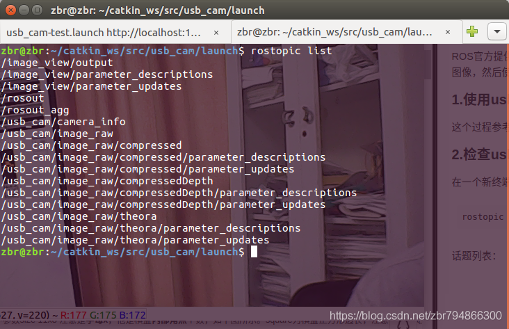
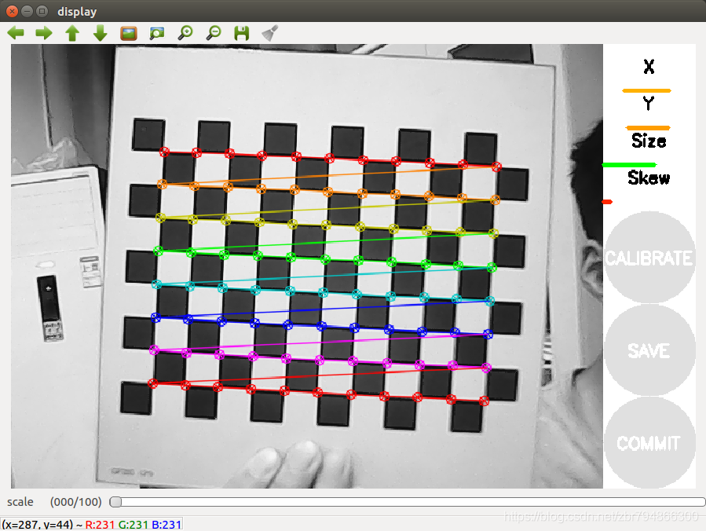
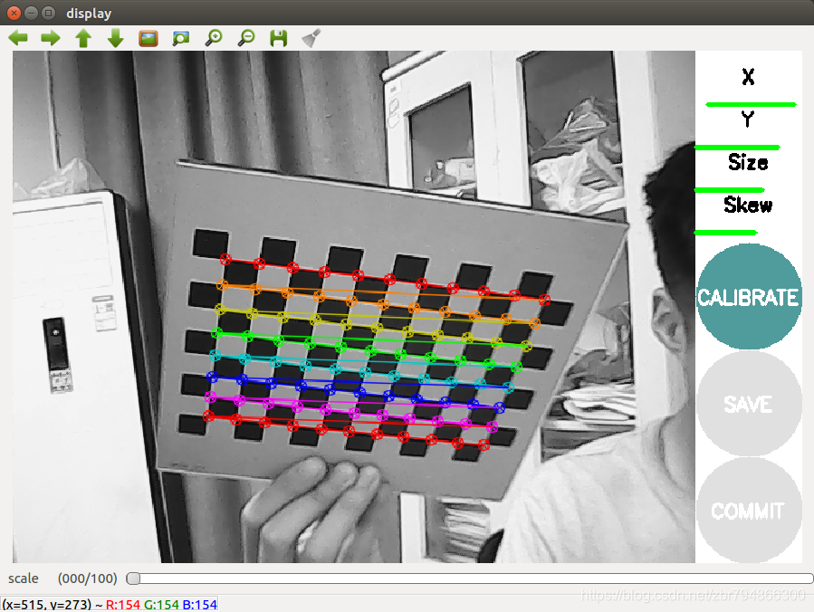
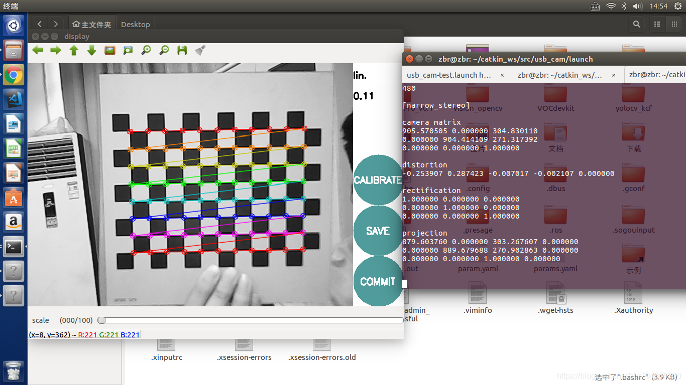
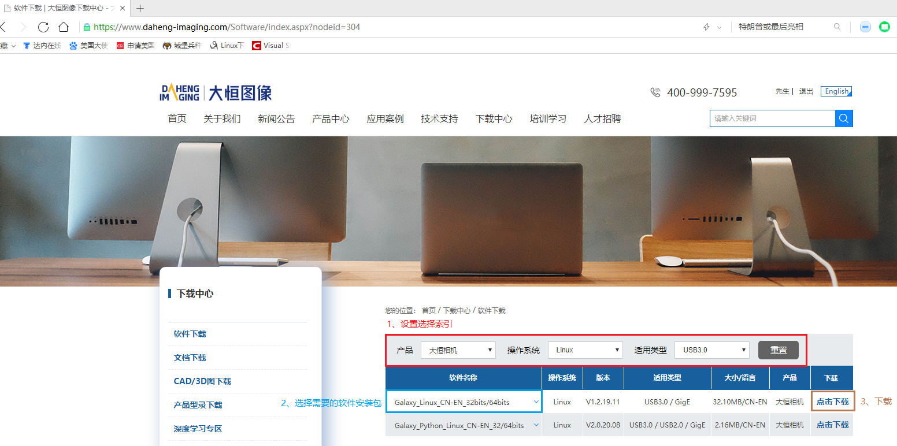

# 一、ROS基础知识补充 #
<font size=3>
    1. 查看当前所有正在运行的节点：<font face="Times New Roman">**$ rostopic list**</font><br>
    2. 查看某个topic所发送回来的具体数值：<font face="Times New Roman"><strong>$ rostopic echo "*topic_name*"</strong></font><br>
    <font face="Times New Roman" color=firebrick size=2>
        <strong>
            ※注意：在上述命令行中，""只是为了强调topic_name本身是一个字符串，但是在实际命令行输入时，这对引号是不用加上的。例如，我们要查看/usb_cam/image_raw这个topic所传递的数值，我们输入的命令行为：$ rostopic echo /usb_cam/image_raw<br>
        </strong>
    </font>
</font>
<br>

___

# 二、ROS对于摄像头获取图像矫正的方法 #
## 1. 使用ROS自带的camera_calibration来完成摄像头标定 ##
<font size=3>**具体步骤**：</font><br>
<font size=3>第一步：打开ROS摄像头，在终端输入如下命令：</font>
```bash
$ roslaunch usb_cam usb_cam-test.launch
```
<font face="Times New Roman" color=firebrick size=2>
    <strong>
        ※注意：因为这里为了方便讲解摄像头标定的常规步骤，所以直接用与ROS兼容较好的usb摄像头为例，但并不是说只有用ROS自带的usb_cam节点运行起来的摄像头才能使用camera_calibration进行标定。<br>
    </strong>
</font>
<br>

<font size=3>第二步：检查摄像头运行的topic，在终端输入如下命令：</font>
```bash
$ rostopic list
```
<font size=3>得到如下图所示的话题列表:</font>
<div align=center>
    <br>
</div>
<br>

<font size=3>记住话题名字：</font>
```bash
/usb_cam/camera_info
/usb_cam/image_raw
```
<font face="Times New Roman" color=firebrick size=2>
    <strong>
        ※注意：因为这里我只是拿ROS自带的usb_cam包来运行摄像头，所以只有/image_raw这一个显示图像的topic，如果其他一些ROS自带的摄像头运行包里有/image_rect这个图像显示的topic，可以优先选择/image_rect，因为这个图像是已经矫正过的，所以在此基础上进行标定后，图像数据会更加精确。<br>
    </strong>
</font>
<br>

<font size=3>第三步：启动标定程序，在终端输入如下命令：</font>
```bash
rosrun camera_calibration cameracalibrator.py --size 11x8 --square 0.03 image:=/usb_cam/image_raw camera:=/usb_cam
```
<font size=3>标定程序运行的界面如下：</font>
<div align=center>
    <br>
</div>
<br>

<font face="Times New Roman" color=firebrick size=2>
    <strong>
        ※注意：<br>
        1、image:=和camera:=后面的topic名称以及camera_node名称不要填错，尤其是/，既不要多加，也不要漏加。在ROS中，topic_name和node_name中的/都只是字符串的一部分，并没有什么特殊的含义，一般ROS自带的包中topic和node的名称都会带有/，那么在这里就必须统一加上；如果这里标定的摄像头node和topic是自定义的，且在程序中就没有给node_name和topic_name加上/，那这里就统一不要加。<br>
        2、--size和--square后面所跟随的参数并不是固定的，而是根据自己的标定板来确定的。--size是标定板上的标点矩阵的二维大小，如上图所示，标定板上面的黑白格是12x9，这样可以进行标定的点矩阵大小正好是11x8；--square是标定格正方形的边长，以米为单位，且与实际标定板上的正方形成1：1的比例进行取值，因为我使用的标定板上的正方形边长为3cm，所以这里取值正好为0.03。<br>
    </strong>
</font>
<br>

<font size=3>
    第四步：摄像头标定：<br>
    1、为了得到一个好的标定结果，应该使得标定板尽量以不同的姿态出现在摄像头视野的各个位置里，例如，标定板出现在图像视野中的左边，右边，上边和下边，标定板既有倾斜的，也有水平的。<br>
    2、界面中具体参数的说明：<br>
</font>

- <font size=3>X：表示标定板在视野中的左右位置</font>
- <font size=3>Y：表示标定板在视野中的上下位置</font>
- <font size=3>Size：标定板在占视野的尺寸大小，也可以理解为标定板离摄像头的远近</font>
- <font size=3>Skew：标定板在视野中的倾斜范围。</font>
  
<font size=3>随着标定板在捕捉画面中占图比和角度的不断变化，终端会记录不同的坐标数据，等数据数据收集足够时，标定程序界面的"CALIBRATE"按键会由灰变蓝，如下图所示：</font>
<div align=center>
    <br>
</div>
<br>

<font size=3>此时点击"CALIBRATE"按键，标定程序界面会变成灰色，且无法对齐进行任何操作，这是正常的，因为程序在后台进行畸变的矫正运算，耐心等一下就好了。等标定运算完成后，终端中会显示摄像头的输出信息，如下图所示：</font>
<div align=center>
    <br>
</div>
<br>

<font size=3>最后，如果满意标定结果，点击COMMIT按钮将结果默认保存到文件中，运行usb_cam的终端窗口会输出info，下次重启usb_cam时，就会自动调用标定保存的head_camera.yaml文件。</font><br>
<font face="Times New Roman" color=firebrick size=2>
    <strong>
        ※注意：<br>
        1、我使用的标定板是硬纸板，所以无论怎么移动都可以保证标定方格始终是处在同一平面的，如果是用A4纸打印下来的标定纸，那么就需要改成将标定纸固定放在桌面上，通过移动摄像头的位置来完成摄像头标定操作，因为手持标定纸很难保证在标定过程中纸不存在半点的卷曲，虽然当标定纸卷曲时，标定界面依旧会在图像上标出点位，但是因为标定方格不在同一平面上，得到的数据是有问题的，在点击"CALIBRATE"按键后，后台算法会因为数据有误而无法计算出标定结果，从而直接出错退出。<br>
        2、因为camera_calibration标定节点本来就是和usb_cam节点配合来使用的，所以二者之间的兼容度非常高，所以只有在使用cam_usb包来运行的摄像头，其标定结果会在点击"COMMIT"按键后直接保存到head_camera.yaml文件；如果是其他自定义的包所运行的摄像头，其标定结果会在点击"COMMIT"按键后统一存放到~/.ros/camera_info/目录下。<br>
    </strong>
</font>
<br>

## 2. 使用ROS自带的image_proc包来对图像进行矫正 ##
<font face="Times New Roman" color=FireBrick size=2>
    <strong>
        ※注意：在初次使用ROS自带的image_proc前对获取图像进行修正前必须先对摄像头进行上述标定操作，无论是与ROS兼容度高的usb_cam所驱动的摄像头，还是其他的工业类型摄像头都需如此，因为ROS在启动image_proc包时，会去~/.ros/camera_info目录下查找摄像头标定数据的yaml文件，没有此文件，该package就无法正常工作。<br>
    </strong>
</font>
<font size=3>具体步骤：</font><br>
<font size=3>第一步：打开ROS摄像头，在终端输入如下命令：</font>

```bash
$ roslaunch usb_cam usb_cam-test.launch
```
<font size=3>第二步：运行image_proc包下的节点，来发布矫正过的图像，在终端输入如下命令：</font>
```bash
ROS_NAMESPACE=/usb_cam rosrun image_proc image_proc
```
<font size=3>第三步：检查当前运行的节点，找到矫正过后的图像topic</font>
```bash
$ rostopic list
```
<font size=3>这里我显示矫正过后的图像topic是`/usb_cam/image_rect`</font><br>
<font face="Times New Roman" color=FireBrick size=2>
    <strong>
        ※注意：通常情况下，使用image_proc包矫正过的图像topic，无论是ROS自带的摄像头驱动包，还是其他一些开发厂商的摄像头驱动包，矫正过后的图像topic格式都是`/[*camera_name*]/image_rect`，所以一般我们在编写node源程序时，如果也用到了image_proc包，且将图像进行二次发布，我们也应将topic命名为该格式。<br>
    </strong>
</font>
<br>
<font size=3>第四步(可选步骤)：显示矫正过后的图像</font><br>
<font size=3>因为我这里直接使用的是ROS自带的usb_cam包中的launch文件驱动的摄像头，所以直接在这个launch文件中进行修改即可，输入终端命令：</font>
```bash
$ sudo gedit /opt/ros/melodic/share/usb_cam/launch/usb_cam-test.launch
```
<font size=3>将`<remap from="image" to="/usb_cam/image_raw"/>`修改为`<remap from="image" to="/usb_cam/image_rect"/>`，然后保存退出即可，这样下次再运行这个launch文件时，就会显示经过image_proc矫正过的图像。</font><br>
<font face="Times New Roman" color=FireBrick size=2>
    <strong>
        ※注意：<br>
        1、如果ROS和ROS自带的功能包是通过`sudo apt-get install xxx`命令安装的，那么所有的ROS包全部是都是存放在`/opt/ros/版本/share/`目录下的，版本根据自己的情况而定，我使用的是ROS-melodic，所以"版本"处填写的就是melodic，所有存放在根目录下的文件，修改都需要使用sudo权限，否则无法对其内容进行修改。<br>
        2、对于初学者而言，建议不要像我一样直接在`/opt/ros/版本/share/`目录里对文件进行修改，而是将其复制到自己的catkin_ws目录下再进行改动，否则一旦修改错误，这个包很可能就会彻底无法使用了。<br>
        3、对于其他包驱动的摄像头而言，其实也都是在编写launch文件时，将原本应该填写`/image_raw`的地方用`/image/rect`来替代。<br>
    </strong>
</font>
<br>

___

# 三、基于OpenCV的MER-500-14U3M-L图像显示例程 #
<font size=3>**第一步：安装SDK**</font><br>
<font size=3>SDK下载网址：[https://www.daheng-imaging.com/Software/index.aspx?nodeid=304](https://www.daheng-imaging.com/Software/index.aspx?nodeid=304)</font><br>
<font size=3>进入下载网页后，选择名为"Galaxy_Linux_CN-EN_32bits/64bits"软件包进行下载，如下图所示：</font>
<div align=center>
    <br>
</div>
<br>

<font size=3>下载后得到压缩文件"Galaxy_Linux-x86_Gige-U3_32bits-64bits_1.2.1911.9122.tar"，解压该文件，并进入文件夹，通过终端命令`./Galaxy_camera.run`安装大恒摄像头所需的SDK。若有其他安装疑问，可以直接参考同文件夹下的README.md文件。</font>

<font size=3>安装完成SDK后，在`Galaxy_camera/doc/`目录下可以找到`C软件开发说明书.pdf`文件，可以根据这个说明文件进行程序开发。</font><br>

<font size=3>**第二步：创建OpenCV工程文件**</font><br>

1. <font size=3>打开终端，输入创建OpenCV工作空间，并进入工作空间的文件夹，同时将`/usr/lib`目录下的`libgxiapi.so`文件复制到当前目录下</font>
```bash
$ mkdir factory-camera
$ cd factory-camera 
$ sudo cp /usr/lib/libgxiapi.so ./
```

2. <font size=3>创建include文件夹，并将`/MER-500-14U3M-L/Galaxy_camera/inc`目录下的两个头文件`DxImageProc.h`和`GxIAPI.h`拷贝至include目录下</font>
```bash
$ mkdir include
$ cp ~/MER-500-14U3M-L/Galaxy_camera/inc/DxImageProc.h ./include/
$ cp ~/MER-500-14U3M-L/Galaxy_camera/inc/GxIAPI.h ./include/
```

<font face="Times New Roman" color=firebrick size=2>
    <strong>
        ※注意：我这里的MER-500-14U3M-L文件夹就是压缩文件解压后得到的文件夹，只是为了方便命令输入，我将其重命名为了"MER-500-14U3M-L"，这个文件夹名字可以根据个人喜好随意更改，其并不会影响最终Galaxy_camera文件夹的安装路径和位置，只要在终端运行了./Galaxy_camera.run命令成功安装SDK，Galaxy_camera文件夹一定会出现在Galaxy_camera.run所在的目录下。<br>
    </strong>
</font>

3. <font size=3>创建SRC文件夹，编写main.cpp主程序</font>
```bash
$ mkdir SRC
$ cd SRC
$ vi main.cpp
```

<font size=3>main.cpp的程序如下：</font>

```C++
#include "GxIAPI.h"
#include "DxImageProc.h"
#include <iostream>
#include <opencv2/opencv.hpp>

using namespace std;
using namespace cv;

int main(int argc, char *argv[])
{
    /*GX_STATUS类型实质是int32_t，即int类型，而GX_STATUS_SUCCESS是枚举型结构体GX_STATUS_LIST中的枚举常量，表示“成功”*/
    GX_STATUS status = GX_STATUS_SUCCESS;
    /*GX_DEV_HANDEL类型实质上void*类型，其是一个设备句柄，通过GXOpenDevice获取，用来获取控制与数据采集*/
    GX_DEV_HANDLE hDevice = NULL;
    uint32_t nDeviceNum = 0;
    
    //GXInitLib()函数的功能是初始化库，这是MER-500-14U3M-L摄像头工作流程的第一步，用户在使用GxlAPI接口之前必须调用GXInitLib()对库进行初始化操作
    /*
    *GXInitLib()函数没有参数，其有两个返回值
    *   1、GX_STATUS_SUCCES：操作成功，没有发生错误
    *   2、GX_STATUS_NOT_FOUND_TL：找不到TL库
    */
    status = GXInitLib();
    if (status != GX_STATUS_SUCCESS)
    {
        return 0;
    }
    
    //GXUpdateDeviceList()函数的功能是枚举当前可用的所有设备列表，并获取设备个数，这是MER-500-14U3M-L摄像头工作流程的第二步
    /*
    *GXUpdateDeviceList()函数的两个参数
    *   1、[out] (uint32_t *)punNumDevices：用来返回设备个数的地址指针，不能为NULL指针
    *   2、[in]  (uint32_t) nTimeOut：枚举的超时时间（单位ms）
    *如果在用户指定的超时时间内成功枚举到设备，则立即返回；若在用户制定的超时时间内没有枚举到设备，则一致等待，直到达到用户指定的超时时间返回
    *----------
    *GXUpdataDeviceList()函数常见的三个返回值
    *   1、GX_STATUS_SUCCESS：操作成功，没有发生错误
    *   2、GX_STATUS_NOT_INIT_API：没有调用GXInitLib初始化库
    *   3、GX_STATUS_INVALID_PARAMETER：用户输入的指针为NULL
    *除此以外，不常见的详细错误情况可以查询GX_STATUS_LIST中的枚举常量
    */
    status = GXUpdateDeviceList(&nDeviceNum, 1000);
    if ((status != GX_STATUS_SUCCESS) || (nDeviceNum <= 0))
    {
        return 0;
    }
    cout << "Open success!"<<endl;

    uint32_t entrynums;
    //GXGetEnumEntryNums()函数的功能是获取枚举项的可选项个数
    /*
    *GXGetEnumEntryNums()函数的三个参数
    *   1、[in] (GX_DEV_HANDLE) hDevice：设备句柄
    *   2、[in] (GX_FEATURE_ID) featureID：要操作的功能码，其具体的定义在GxIAPI.h头文件中的枚举型结构体GX_FEATURE_ID中。
    *   GX_ENUM_PIXEL_FORMAT表示设备提供的像素格式
    *   3、[out] (uint32_t *)pnEntryNums：指向返回的个数的指针
    *----------
    *GXGetEnumEntryNums()函数常见的六个返回值
    *   1、GX_STATUS_SUCCESS：操作成功，没有发生错误
    *   2、GX_STATUS_NOT_INIT_API：没有调用GXInitLib初始化库
    *   3、GX_STATUS_INVALID_HANDLE：用户传入非法的句柄
    *   4、GX_STATUS_NOT_IMPLEMENTED：当前不支持的功能
    *   5、GX_STATUS_ERROR_TYPE：用户传入的featureID类型错误
    *   6、GX_STATUS_INVALID_PARAMETER：用户输入的指针为NULL
    *除此以外，不常见的详细错误情况可以查询GX_STATUS_LIST中的枚举常量
    */
    status = GXGetEnumEntryNums(hDevice, GX_ENUM_PIXEL_FORMAT, &entrynums);

    int64_t nPixelFormat = 0;
    //GXGetEnum()函数的功能是获取当前枚举值
    /*
    *GXGetEnum()函数的三个参数
    *   1、[in] (GX_DEV_HANDLE) hDevice：设备句柄
    *   2、[in] (GX_FEATURE_ID) featureID：要操作的功能码，其具体的定义在GxIAPI.h头文件中的枚举型结构体GX_FEATURE_ID中。
    *   3、[out] (int64_t *)pnValue：指向返回结果的指针
    *----------
    *GXGetEnum()函数常见的七个返回值
    *   1、GX_STATUS_SUCCESS：操作成功，没有发生错误
    *   2、GX_STATUS_NOT_INIT_API：没有调用GXInitLib初始化库
    *   3、GX_STATUS_INVALID_HANDLE：用户传入非法的句柄
    *   4、GX_STATUS_NOT_IMPLEMENTED：当前不支持的功能
    *   5、GX_STATUS_ERROR_TYPE：用户传入的featureID类型错误
    *   6、GX_STATUS_INVALID_PARAMETER：用户输入的指针为NULL
    *   7、GX_STATUS_INVALID_ACCESS：当前不可访问，不能读
    *除此以外，不常见的详细错误情况可以查询GX_STATUS_LIST中的枚举常量
    */
    status = GXGetEnum(hDevice, GX_ENUM_PIXEL_FORMAT, &nPixelFormat);

    //GXOpenDeviceByIndex()函数的功能是通过序号索引打开一个设备，这是MER-500-14U3M-L摄像头工作流程的第三步，但却是摄像头控制流程的第一步
    /*
    *GXOpenDeviceByIndex()函数的两个参数
    *   1、[in] (uint32_t) nDeviceIndex：设备序号，注意：设备序号是从1开始的，不是从0开始
    *   2、[out] (GX_DEV_HANDLE *)phDevice：接口返回的设备句柄
    *----------
    *GXOpenDeviceByIndex()函数的四个常见返回值
    *   1、GX_STATUS_SUCCESS：操作成功，没有发生错误
    *   2、GX_STATUS_NOT_INIT_API：没有调用GXInitLib初始化库
    *   3、GX_STATUS_INVALID_PARAMETER：用户输入的指针为NULL
    *   4、GX_STATUS_OUT_OF_RANGE：输入设备序号越界
    */
    status = GXOpenDeviceByIndex(1, &hDevice);
    if (status == GX_STATUS_SUCCESS)
    {
        //本程序用的是DQBuf的采集流程，该流程仅Linux支持

        /*
        *注意事项：
        *1、用户采集开始线程，即GXStreamOn()函数必须在图像采集流程开始后调用；用户采集结束线程，即GXStreamOff()函数必须在图像采集流程结束前调用
        *2、调用GXQBuf接口将图像buf放回GxlAPI库后，不能再访问该图像buf指针
        *3、GXStreamOff停止图像采集接口会通过GXDQBuf获取到的图像buf放回GxlAPI库，之后不能再访问这些图像buf指针
        */

        //定义GXDQBuf()接口函数所需要的传入参数
        PGX_FRAME_BUFFER pFrameBuffer;
        //开始循环采集图像
        while (true)
        {
            //GXStreamOn()函数的功能是开始采集数据，包括流开采和设备开采，在DQBuf采集流程中，打开设备后，就需要完成这一步骤
            /*
            *GXStreamOn()函数的一个参数
            *   1、[in] (GX_DEV_HANDLE) hDevice：设备句柄
            *----------
            *GXStreamOn()函数的五个常见返回值
            *   1、GX_STATUS_SUCCESS：操作成功，没有发生错误
            *   2、GX_STATUS_NOT_INIT_API：没有调用GXInitLib初始化库
            *   3、GX_STATUS_INVALID_HANDLE：用户传入非法的句柄
            *   4、GX_STATUS_INVALID_ACCESS：设备访问模式错误
            *   5、GX_STATUS_ERROR：不期望发生的未明确指明的内部错误
            *----------
            *注意：GXStreamOn会开启所有的流通道
            */
            status = GXStreamOn(hDevice);
            if (status == GX_STATUS_SUCCESS)
            {
                //GXDQBuf()接口函数的功能是在开始采集后，获取一帧图像
                /*
                *GXDQBuf()接口函数的三个参数
                *   1、[in] (GX_DEV_HANDLE) hDevice：设备句柄
                *   2、[out] (PGX_FRAME_BUFFER *)pFrameBuffer：接口输出的图像数据的地址指针
                *   3、[in] (uint32_t) nTimeOut：获取图像的超时时间(单位ms)
                *----------
                *GXDQBuf()接口函数的七个常见返回值
                *   1、GX_STATUS_SUCCESS：操作成功，没有发生错误
                *   2、GX_STATUS_NOT_INIT_API：没有调用GXInitLib初始化库
                *   3、GX_STATUS_INVALID_HANDLE：用户传入非法的句柄
                *   4、GX_STATUS_INVALID_PARAMETER：用户输入的指针为NULL
                *   5、GX_STATUS_INVALID_CALL：未开采或注册回调，不允许调用该接口
                *   6、GX_STATUS_TIMEOUT：采集图像超时错误
                *   7、GX_STATUS_ERROR：不期望发生的未明确指明的内部错误
                *除此以外，不常见的详细错误情况可以查询GX_STATUS_LIST中的枚举常量
                */
                status = GXDQBuf(hDevice, &pFrameBuffer, 1000);
                if (status == GX_STATUS_SUCCESS)
                {
                    //判断获取的这帧图像是否为正常帧
                    /*PGX_FRAME_BUFFER类型是结构体GX_FRAME_BUFFER的别名，在该结构体中，nStatus表示获取的图像状态*/
                    /*nStatus的类型是枚举型结构体GX_FRAME_STATUS_LIST，其中包含两个枚举型成员变量，分别是GX_FRAME_STATUS_SUCCESS和GX_FRAME_STATUS_INCOMPLETE*/
                    /*其中，GX_FRAME_STATUS_SUCCESS表示正常帧，GX_FRAME_STATUS_INCOMPLETE表示残帧*/
                    if (pFrameBuffer->nStatus == GX_FRAME_STATUS_SUCCESS)
                    {
                        //程序到这里就已经成功获取摄像头的图像了，这个if()判断层次所做的内容就是对图像进行处理

                        //对图像进行处理...
                        
                        /*在枚举型结构体GX_FRAME_STATUS_LIST，nWidth和nHeight分别表示摄像头获取图像的宽和高*/
                        int width = pFrameBuffer->nWidth;
                        int height = pFrameBuffer->nHeight;
                        cout << "pFrameBuffer size: " << width << "x" << height << endl;

                        //将图像转换为OpenCV格式便于处理和显示
                        /*
                        *这是一个Mat类的构造函数的多个重载函数中的一种函数原型：
                        *cv::Mat::Mat(Size size,    //待转换格式的图像的二维大小，即图像的宽(列)和高(行)
                        *             int type,     //OpenCV格式，确定存储数据的数据类型，CV_8UC1表示类型——8位，无符号，通道数1
                        *             void *data,   //需要进行格式转换的图像。
                        *                           -----pImgBuf是GX_FRAME_BUFFER结构体中的成员变量，其实质是一个指向图像数据的指针，
                        *                           -----在获取帧图像信息后，它会包含图像数据和帧信息数据
                        *             size_t step   //每个矩阵的行所占据的字节数，如果缺少参数就默认设置为AUTO_STEP
                        *             )
                        *----------
                        *img就是转换为OpenCV格式的图像
                        */
                        Mat img(Size(width, height), CV_8UC1, (void*)pFrameBuffer->pImgBuf, Mat::AUTO_STEP);
                        //resize()函数的功能是改变图像的大小
                        /*
                        *函数原型：
                        *resize(InputArray src,     //待改变大小的图像矩阵
                        *       OutputArray dst,    //目标图像矩阵，即存放修改大小后的图像的变量
                        *       Size dsize,         //目标图像矩阵的大小，dsize=Size(round(fx*src.cols),round(fy*src.rows))
                        *       double fx,          //图像水平轴的比例因数，一般取默认值0
                        *       double fy,          //图像垂直轴的比例因数，一般取默认值0
                        *       int interpolation   //插值法
                        *      )
                        *----------
                        *插值法的常见宏定义：
                        *1、INTER_LINEAR——   双线性插值法，如果缺省，则默认为此方法
                        *2、INTER_NEAREST——  最邻近插值法
                        *3、INTER_CUBIC——    4*4像素领域的双立方插值
                        *4、INTER_AREA——     使用像素面积关系进行重采样。这可能时首选的图像抽取方法，因为它可以提供无波纹的结果；但是但图像缩放时，它类似于INTER_LINEAR的方法
                        *5、INTER——LANCZOS4——8*8像素领域内的Lanczos插值
                        */
                        //resize(img, img, Size(width / 2, height / 2), 0, 0, INTER_AREA);
                        namedWindow("img", WINDOW_NORMAL); 
                        cout << "OpenCV size: " << img.cols << "x" << img.rows << endl;
                        //显示图像
                        imshow("img", img);
                        //将开始采集后获取的第一帧图像写入规定路径的图片文件中
                        imwrite("../PICTURE/test.png", img);
                        //等待按键
                        waitKey(1);
                    }
                    //DQBuf图像采集可以通过循环调用GXDQBuf和GXQBuf来连续采集图像，GXQBuf()函数的功能就是在开始采集后，将图像Buf放回GxlAPI库中，继续用于采图
                    /*
                    *GXQBuf()接口函数的两个参数
                    *   1、[in] (GX_DEV_HANDLE) nDevice：设备句柄
                    *   2、[in] (PGX_FRAME_BUFFER) pFrameBuffer：待放回GxlAPI库的图像数据Buf指针
                    *----------
                    *GXQBuf()接口函数的五个常见返回值
                    *   1、GX_STATUS_SUCCESS：操作成功，没有发生错误
                    *   2、GX_STATUS_NOT_INIT_API：没有调用GXInitLib初始化库
                    *   3、GX_STATUS_INVALID_HANDLE：用户传入非法的句柄
                    *   4、GX_STATUS_INVALID_PARAMETER：用户输入的指针为NULL
                    *   5、GX_STATUS_INVALID_CALL：未开采或注册回调，不允许调用该接口
                    *除此以外，不常见的详细错误情况可以查询GX_STATUS_LIST中的枚举常量
                    */
                    status = GXQBuf(hDevice, pFrameBuffer);
                }  
            } 
        }
        //GXStreamOff()函数的功能是停止采集，包括停止流采集和停止设备采集
        /*
        *GXStreamOff()函数的一个参数
        *   1、[in] (GX_DEV_HANDLE) hDevice：设备句柄
        *----------
        *GXStreamOff()函数的六个常见返回值
        *   1、GX_STATUS_SUCCESS：操作成功，没有发生错误
        *   2、GX_STATUS_NOT_INIT_API：没有调用GXInitLib初始化库
        *   3、GX_STATUS_INVALID_HANDLE：用户传入非法的句柄
        *   4、GX_STATUS_INVALID_ACCESS：设备访问模式错误
        *   5、GX_STATUS_INVALID_CALL：无效的接口调用
        *   6、GX_STATUS_ERROR：不期望发生的未明确指明的内部错误
        *除此以外，不常见的详细错误情况可以查询GX_STATUS_LIST中的枚举常量
        */
        status = GXStreamOff(hDevice); 
    }
    //GXCloseDevice()函数的功能是制定设备句柄关闭设备，这是MER-500-14U3M-L摄像头工作流程的倒数第二步
    /*
    *GXCloseDevice()函数的一个参数
    *   1、[in] (GX_DEV_HANDLE) hDevice：用户指定的要关闭的设备句柄
    *----------
    *GXCloseDevice()函数的三个常见返回值
    *   1、GX_STATUS_SUCCESS：操作成功，没有发生错误
    *   2、GX_STATUS_NOT_INIT_API：没有调用GXInitLib初始化库
    *   3、GX_STATUS_INVALID_HANDLE：用户传入非法的句柄，或重复关闭设备
    *除此以外，不常见的详细错误情况可以查询GX_STATUS_LIST中的枚举常量
    *----------
    *注意事项：关闭已经被关闭的设备句柄，返回GX_STATUS_INVALID_HANDLE错误
    */
    status = GXCloseDevice(hDevice); 
    //GXCloseLib()函数的功能是关闭设备库，释放资源，这是MER-500-14U3M-L摄像头工作流程的最后一步，用户在停止GxlAPI对设备进行的所有控制之后，必须调用GXCloseLib()接口释放资源，与GXInitLib()对应
    /*
    *GXCLoseLib()函数没有参数，其有一个返回值
    *   1、GX_STATUS_SUCCES：操作成功，没有发生错误
    */
    status = GXCloseLib(); 
    
    return 0;
}
```

4. <font size=3>编写CMakeLists.txt文件</font>
```bash
$ cd ../
$ vi CMakeLists.txt
```
<font size=3>CMakeLists.txt文件的内容如下：</font>
```text
#定义需要CMake的最低版本
cmake_minimum_required(VERSION 2.8)
#定义工程名称，该名称会被保存在${PROJECT_NAME}变量里
PROJECT(factory-camera)
#---#
#搜索OpenCV的依赖项
FIND_PACKAGE(OpenCV REQUIRED)
#显示检测到的OpenCV版本信息
MESSAGE("OpenCV Version: ${OpenCV_VERSION}")
#在环境中添加指定库的头文件
include_directories(${OpenCV_INCLUDE_DIRS})
include_directories(./include/)
#在环境中添加指定库的目录
link_directories(${OpenCV_LIB_DIR})
link_directories(./)
#---#
#创建SRC变量
SET(SRC SRC/main.cpp)
#创建可执行文件
ADD_EXECUTABLE(${PROJECT_NAME} ${SRC})
#链接库
TARGET_LINK_LIBRARIES(${PROJECT_NAME} ${OpenCV_LIBS} libgxiapi.so)
```

5. <font size=3>创建PICTURE文件夹用来存放获取的图像文件，创建build文件夹对工程进行编译，并运行程序</font>
<font size=3>在终端中输入命令：</font>
```bash
$ mkdir PICTURE
$ mkdir build
$ cd build
$ cmake ../
$ make
$ ./factory-camera
```
<br>

___

# 四、基于ROS的MER-500-14U3M-L图像显示例程 #
<font face="Times New Roman" color=firebrick size=2>
    <strong>
        ※注意：MER-500-14U3M-L型号的摄像头是大恒图像生产的，但是他们的官方客服明确向我说明，大恒摄像头无法兼容ROS，所以只提供开发者Github平台上第三方编写的基于ROS的MER-500-14U3M-L摄像头驱动程序，但是他们并不负责该程序问题的解答。(确实这样很不负责任，但是没办法，谁让我们去用他们的摄像头在ROS上捕捉图像呢！)<br>
    </strong>
</font>
<br>

<font size=3>galaxy_camera文件夹中的内容就是完整的示例程序，且我已经将galaxy_camera/src/galaxy_camera.cpp源文件里的主要代码模块加上了注释，方便初学者进行代码解析(最初的源代码里面真的是连一句注释都没有啊！)，这个package是完全可以使用的，将这个文件夹放到`~/catkin_ws/src/`目录下，并进行catkin_make编译后，在终端输入`roslaunch galaxy_camera cam.launch`，程序就能正常运行了；但是，运行后的程序是不会显示摄像头捕捉到的图像的，我们还需要自己将图像显示出来。</font>

<font size=3>1. 如果只是像简单看一下MER-500-14U3M-L摄像头拍摄到的图像画面，可以通过rqt来观察图像</font><br>
<font size=3>**具体操作：**</font><br>
&emsp;&emsp;在终端中输入`rqt_image_view`，然后将topic选择为`/galaxy_camera/image_raw`或者`/galaxy_camera/image_rect`就可以看到摄像头拍摄到的画面了，但是基于ROS的MER-500-14U3M-L摄像头驱动只能显示ROI区域，所以需要先将cam.launch中的参数设置进行修改(我这里的galaxy_camera文件夹里的cam.launch文件中的参数是已经调整过了的，无需再改动，如果是从github或者gitee上面获取该package的小伙伴才需要执行这一步)，否则图像只能显示左上四分之一的内容，修改后的内容如下：
```text
<launch>
    <node pkg="nodelet" type="nodelet" name="standalone_nodelet" args="manager" output="screen"/>
    <node pkg="nodelet" type="nodelet" name="galaxy_camera" args="load galaxy_camera/GalaxyCameraNodelet standalone_nodelet" output="screen">
        <!-- MER-500-14U3M-L摄像头拍摄到的完整图像像素是2592*1944 -->
        <!-- image_width和image_height是ROI区域的宽和高，单位都是像素，起点是从图像的左上角开始 -->
        <param name="image_width" value="1296"/><!--2592 -->
        <param name="image_height" value="972"/><!--1944-->
        <!-- image_offset_x和image_offset_y是ROI区域相对于起点位置的偏移量 -->
        <param name="image_offset_x" value="648"/>
        <param name="image_offset_y" value="486"/>
        <!-- 所以通过调整image_width和image_height可以改变显示图像的大小，而通过调整image_offset_x和image_offset_y可以保证显示图像是摄像头对准的中心位置 -->
        <param name="pixel_format" value="bgr8"/>
        <param name="pixel_format" value="bgr8"/>
        <param name="camera_info_url" value=""/>
        <param name="camera_frame_id" value="pitch_camera"/>
    </node>
    <!-- 分割线 -->
    <node ns="galaxy_camera" name="image_proc" pkg="image_proc"
          type="image_proc" respawn="true"/>
</launch>
```
<font size=3>具体的ROI说明可以查看`C软件开发说明书.pdf`这个说明文档。</font><br>
<br>

<font size=3>2. 如果需要对摄像头拍摄的图像进行二次处理，那么就需要自行编写package例程了。</font><br>
&emsp;&emsp;galaxy_sub文件夹里的程序内容就是我自己所编写的订阅galaxy_camera拍摄图像的package程序，是直接可以拿来用的，只要把这个文件夹放到`catkin_ws/src`目录下，执行catkin_make编译即可。而且因为我已经在`galaxy_sub/launch/galaxy_sub.launch`文件中并入了`cam.launch`文件的内容，所以直接在终端输入`roslaunch galaxy_sub galaxy_subscribe_node`即可，MER-500-14U3M-L摄像头也会被启动。